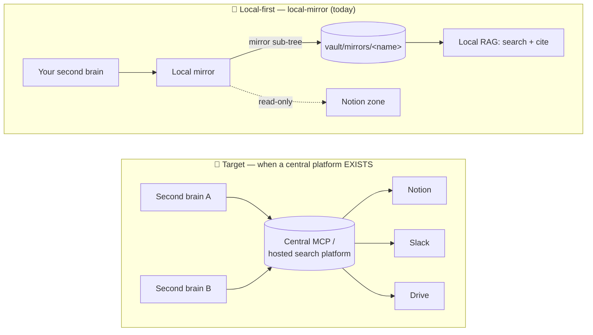

# Connectors — wiring up your external sources

The generator's RAG engine answers from **your notes** (the `vault/`). **Connectors** give it
access to your **other sources** — mail, calendar, Notion, files, chat — so it can cross-reference
everything in one place. **Everything is optional**: with no connector at all, the second brain
already works — it answers on its own from the vault.

This file is an **idea menu** to help you choose *what* to wire up based on *your* need. The
*how* (wizard, manual, credentials) is detailed in [SETUP §6](SETUP.md).

---

## Two families of connectors

| Family | What it is | Where it plugs in |
|---|---|---|
| **Native claude.ai** | A connector managed by your claude.ai account (Slack, Gmail, Calendar, Notion, Drive…). | Account-side: *Settings → Connectors*. **Nothing** to write in `.mcp.json`. |
| **Community MCP** | An MCP server you host/run yourself (often an npm package). | In `.mcp.json` (the installer wizard can do it for you) + permissions in `.claude/settings.json`. |

> Several sources exist **in both families** (e.g. Google Drive, Notion). The **native** one is
> generally the simplest to get started; the **community MCP** gives you more control (scopes,
> self-hosting, your own credentials).

---

## Menu — which connector for which need

| You want to query… | Connector idea | Family | What it's for |
|---|---|---|---|
| **Notes / wikis** Notion | `@notionhq/notion-mcp-server`, or native Notion | MCP **or** native | Search your databases/pages (specs, wikis, KB); read a page to cross-reference with your notes. |
| **Mail** | Native Gmail | native | Find a mail/thread on a topic, a client, a commitment; capture decisions and actions exchanged by mail. |
| **Calendar** | Native Google Calendar | native | Read the day's/week's calendar to give context to a question or a briefing. |
| **Files / documents** | `@modelcontextprotocol/server-gdrive`, `@isaacphi/mcp-gdrive`, or native Drive | MCP **or** native | Find and read specs, meeting notes, exports. |
| **Team chat** | Native Slack | native | Search messages and threads; read a channel / unreads to capture what's moved. |
| **Meeting transcripts** (Meet) | **Calendar + Drive** | native + MCP | See the dedicated section below. |

---

## 🪞 Local mirrors — *mirror* a live source into your vault (≠ a search connector)

A **connector** lets the brain **reach out and search** an external source on the fly. A **local
mirror** (a *copie miroir* / *réplica locale*) does the opposite: it **mirrors** a chosen zone of an
internal tool **into your vault** as Markdown, so the source's content becomes **first-class, indexed,
citable notes** — *the central RAG you don't have yet, but local and right now.*

- **Today: Notion.** You declare the **root page** of a zone (its whole sub-tree is in scope) and the
  brain keeps `vault/mirrors/<name>/` in sync with it — new/edited pages rewritten, deleted /
  out-of-scope pages removed, delta-only (no noise).
- **How:** the **`/local-mirror` skill** drives it (onboard, sync, check freshness, status, remove);
  the work runs in the built-in **`local-mirror`** MCP server. The Notion integration **token
  lives only in `.env`**, never in the chat.
- **Stays fresh on its own.** While a brain window is open, the mirror server re-checks freshness on a
  timer and re-syncs only what fell behind — no question needed. Tune the cadence with
  **`LOCAL_MIRROR_SYNC_INTERVAL`** in `.env` (seconds, **default 300**; **`0` = off**, keeping only the
  refresh-when-you-ask path). It is session-scoped, not a 24/7 daemon.
- **When to prefer it over a Notion search connector:** when a body of reference docs is **a reliable
  reference** for recurring questions and you want it **always fresh, framed and cited** inside the
  brain — not searched ad hoc, side by side.

> Setup walk-through: ask your brain *"set up a local mirror of a Notion zone"* (or run `/local-mirror`).
> The skill explains each step and tests the scope before the first sync.

> 🔑 **Need a Notion token?** Follow the click-by-click, screenshot guide:
> **[Create a Notion token — step by step](docs/notion-token-setup.md)** (~3 min, no coding).

**What gets mirrored — and what doesn't.** Only the **declared root page and its sub-tree** is pulled
in: every page's **Notion text** becomes a searchable, citable note. Two limits to know up front:

- **Links to other Notion spaces are not copied** — a page merely *linked* from the zone but living in
  another tree stays a link, not a local note.
- **Attached PDFs and Google Slides are not extracted** — only the page's Notion text is mirrored, not
  the contents of embedded files. (Your brain flags this at use-time when a question would need them.)
  If you need a PDF/Slides' key facts indexed, paste them into the Notion page as text.

### 🤔 Why a local mirror — and when it's (not) worth it

In an **ideal** world there would be a **central search platform**: one hosted index, plugged in real
time onto every internal tool, available to everyone — including people without a second brain. That's
the **target**. It usually **doesn't exist yet** in your company.

A local mirror is the **local-first** answer in the meantime: instead of waiting for that central
infrastructure, **your own brain mirrors** the live zone that concerns you and indexes it locally. Zero
infra to operate, works today, and the day a central platform arrives you switch over **without
rewriting anything** — same concept, same vault, same content.

**Reach for a local mirror when:**

- there is **no central search platform** for your team, but a body of reference docs lives in Notion;
- you want that zone **always fresh, framed and cited** inside the brain — not searched ad hoc,
  side by side, every time;
- you value **offline / local-first**: the content is real notes in your vault, searchable and
  citable even with no network.

**Don't bother (use something else) when:**

- a **real central MCP / search platform** already exists → just query that instead;
- it's **one-off** content → paste it into a plain note, no mirroring machinery needed;
- the source **isn't Notion** → not supported yet (Drive / Slack / … are on the trajectory, not here
  today).

> **With** central infrastructure, brains query one hosted platform. **Without** it, a local mirror
> replicates a live zone into your **own** vault — searchable, citable, yours, right now. Same
> vault contract; the day a central platform exists, you switch over without rewriting the engine.

> 🛠️ *Maintainers:* the full rationale lives in the PRD —
> [positioning (§1)](maintainers/plans/prd-golden-source-sync.md#1-problem--positioning) and
> [trajectory (§19)](maintainers/plans/prd-golden-source-sync.md#19-trajectory-out-of-mvp).

---

## 🎙️ Meeting transcripts — a use case, not a connector

This is the classic trap: people go looking for "the transcripts connector." **You don't need
one.** When you record a video call (Google Meet / Gemini), the transcription shows up in **two
places** you've probably already wired up:

1. **In the event invitation** → the link to the recording / transcription is often attached to
   the event. You retrieve it via **Google Calendar**.
2. **On your Google Drive** → the **transcription document** lands there automatically. You find it
   via **Google Drive** (search recent docs, then read the right one).

So: wire up **Calendar** *and* **Drive**, and your transcripts are accessible — **without**
depending on a third-party meeting-bot tool (Fireflies, Fathom, Granola, tl;dv…). If you use one
of these tools and it exposes an MCP, you can add it on top, but it's **not necessary** to get
started.

---

## How to wire them up

Three paths, detailed in [SETUP §6](SETUP.md):

- **(a) The installer wizard** *(recommended)* — at step **5/9**, it offers the catalog, shows you
  **what each source is for**, and for **MCP** connectors it writes the server block in `.mcp.json`
  + the permissions in `.claude/settings.json` all on its own (idempotent).
- **(b) By hand** — you add the MCP server in `.mcp.json` and the permissions yourself.
- **(c) Native claude.ai connectors** — nothing in `.mcp.json`: enable them from your account's
  *Settings → Connectors*.

> 🔐 **Neutrality / security.** The generator hardcodes **no secret**: MCP credentials are `<…>`
> placeholders that **you** fill in. Never commit your real tokens.

---

## Once wired up — document the routing

When a connector is in place, tell Claude **which tool for what** in your `CLAUDE.md`
(section **4. Routing**, sub-part *External sources*). That's what keeps it from hesitating between
two overlapping MCPs. Example table to fill in:

| Source | MCP tool | When to use it |
|---|---|---|
| Drive | `mcp__<drive>__search` | document discovery / recent transcripts |
| Calendar | `mcp__<calendar>__list_events` | today's calendar, transcription link in the event |
| … | … | … |

The internal tooling [`sync-sources`](.claude/skills/sync-sources/SKILL.md) (the engine of Phase 2
— pulling the **delta** of sources in **read-only** sub-agents) relies on these connectors. Replace
its `mcp__<slack>__…`, `mcp__<drive>__…` placeholders with the real names of your tools.
