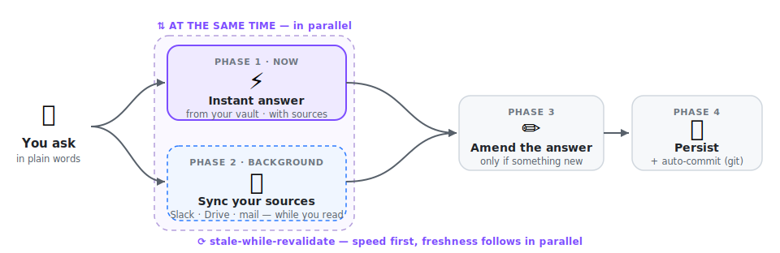
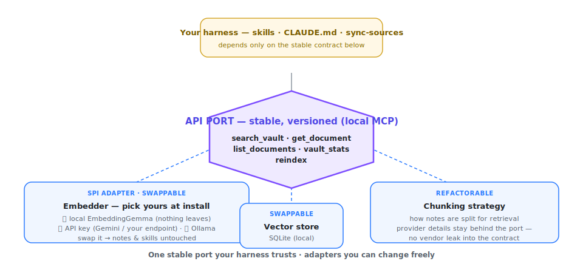

# Kenjaku — your second brain

### 🧠 Just ask. Sit down and relax. &nbsp;*— your second brain handles the rest.*

**All your work, remembered — always up-to-date, always sourced.**

> **One page to *show* what this is.** A visual companion to the [README](README.md) and to
> [“What makes it different”](EN-QUOI-C-EST-DIFFERENT.md). Skim the boards, steal the pitch, point
> people here.

**Ask it like you'd ask a personal assistant — no dev skills required — and pull up any decision or
piece of info from your work in seconds, always with the sources.** *In Claude Desktop or on the
command line, your call.*

---

## The pitch

> **Never miss what matters — and never drown in the rest.** Stay on top of everything moving around
> you, at work and in life, without being buried by the flood you'd otherwise have to sift through
> yourself. And **remember everything that counts** — your decisions, other people's, the things that
> matter — recalled in seconds, **always with the source**. Just ask, in plain words; it **keeps itself
> up to date** by pulling from every source you connect to it.
>
> It stays **personal and private**: your notes are plain Markdown in **your own** git repo, indexed
> **on your machine by default — nothing leaves it** — even as your **work and operational** sources
> get grafted on.

---

<!-- ════════════════════════════════════════════════════════════════════════════════════════════ -->
<!-- ACT 1 — WHY → WHAT (non-tech first). P0 establishes the slots; P1 fills the content (R7–R10).  -->
<!-- ════════════════════════════════════════════════════════════════════════════════════════════ -->

## Why you need it

> *"Wait — you hadn't heard?"* · *"That was decided last week."* · *"You didn't see Sarah's email?"* ·
> *"It's in the #product Slack thread…"*

We've all been on the receiving end of that — **behind**, never having had the chance to catch up, to
read it all, to digest it all. The faster the world moves, the more sources you plug into (Slack, mail,
Drive, meeting transcripts, your own notes) and the more the signal drowns in the noise. Staying on top
of it is a second full-time job — **unless your memory does it for you.**

---

## What it does for you

Three everyday scenes:

- **🛟 Back from a week off — *"what moved while I was out?"*** One question across Slack, mail and your
  notes: the decisions taken, the blockers, what now needs *you* — instead of 400-unread archaeology.
- **🗣️ Live with a customer — *"is this available? in progress? when?"*** Plugged into the roadmap, the
  commitments and what's shipping, your brain hands you a **fresh, reliable** answer to relay on the spot.
- **🔎 *"What are customers actually asking for?"*** Wire in the CRM and the call transcripts — then,
  instead of drowning in them, ask: it **filters to what concerns you**, with the source and the date.

> **Whoever you are** — Head of Engineering, PM, Customer Success, sales, consultant, researcher — it
> keeps *your* thread: your teams and 1-1s, the *why* behind a product decision, a client's whole context.

> **All-audience by design — that's the whole point.** It was **conceived so non-tech profiles can use
> it**: use-case-driven, with the busywork turned into **automatic tasks** and **no temporal coupling**
> to track (never a *"did it refresh before I asked?"*). If you can *chat* with Claude, you can use it —
> you never manage anything; freshness, backup and recovery are all handled for you. **Just ask. Sit
> down and relax.** *(Only the one-time install is technical, and it's guided end-to-end.)*

---

## Three everyday wins — *never forget · never let anyone down · never drown*

The whole point, in three everyday aches it takes off your plate. No jargon needed — the mechanics live
in the small *"if you're curious:"* strip on each board.

> **🧠 Never forget.** Every decision, message and meeting is *kept* — and pulled back the instant you
> ask, always with its source. It answers from **your own notes**, never invents, never wanders off to
> the web.

> **✅ Never let anyone down.** Always know what's on **you** — and what **others** owe you, and by when —
> without carrying it all in your head. A commitment said out loud (*"I'll take care of it"*) lands on the
> right to-do list on its own. No more being late because you forgot you were on the hook.

> **🌊 Never drown.** Plug into all your sources — and everything the rest of the company shares (Slack,
> mail, Drive, Notion & more) — and it **filters the flood** down to what actually concerns you. Read-only:
> it reads your sources, never changes them.

---

## How a question flows — answer now, verify in the background

The web's **stale-while-revalidate** pattern, applied to your memory: you get a **fast** answer from
what's already indexed; freshness catches up **behind the scenes** and only **amends** the answer if
there's genuinely something new. *([details in EN-QUOI §2](EN-QUOI-C-EST-DIFFERENT.md#2-how-it-works-answer-right-away-verify-afterwards))*

---

## What it is — and what it is *not*

| ✅ What it **is** | ⛔ What it is **not** |
|---|---|
| **Yours**, in an open format (Markdown + `[[wikilinks]]`, Obsidian-compatible, your git repo) | **Not "100% private" end-to-end** — the **search** is local by default, but the LLM that **reasons** is still Claude (cloud) |
| **Grounded** — answers cite their sources, with dates; a canary **proves** it queried your vault | **Not zero-install** — daily *use* needs no skill, but the one-time setup (~15 min) assumes git + Node |
| **Cross-cutting** — Slack + Drive + mail + transcripts + your notes, in one place | **Not (yet) multi-AI** — Claude-only for the driving layer (vault + engine stay agnostic) |
| **Zero-chore** — backup, indexing, freshness, recovery, engine updates run on their own | **Not a synced fleet** — each generated brain is self-sufficient and evolves locally |

*Honesty is part of the approach — the full owned-up limitations are in
[EN-QUOI §7](EN-QUOI-C-EST-DIFFERENT.md#7-what-it-is-not-the-owned-up-limitations).*

---

<!-- P1/R6 note: the three comparatives should read in this order — 1) bare LLM, 2) LLM-wiki à la
     Karpathy (TO ADD), 3) other second brains. The Karpathy axis (R6) is still P3 (needs scoping). -->

## vs a bare LLM (ChatGPT / Claude alone)

<!-- Illustrated board: drop docs/img/board-vs-llm.png (prompt in docs/marketing-image-prompts.md), then uncomment:
 -->
> 🎨 *Illustrated board coming — generate `board-vs-llm.png` from
> [`docs/marketing-image-prompts.md`](docs/marketing-image-prompts.md) and drop it in `docs/img/`.*

| | A bare LLM | Your second brain |
|---|---|---|
| **Memory** | Only what you re-paste; forgotten after the chat | **Persistent**, grows with every question |
| **Grounding** | Answers from training — can make things up | **From your notes**, with the source and its date |
| **Scope** | A single walled conversation | **Cross-cutting** across all your tools |
| **Ownership** | Hosted, ephemeral | **Yours**, in Markdown, in your git repo |

<!-- P3/R6: insert "## vs an LLM-wiki (à la Karpathy)" board + table HERE, between bare-LLM and other second brains. -->

---

## vs other "second brains" — a living, personal product (that begins with a generator)

<!-- Illustrated board: drop docs/img/board-generator.png (prompt in docs/marketing-image-prompts.md), then uncomment:
 -->
> 🎨 *Illustrated board coming — generate `board-generator.png` from
> [`docs/marketing-image-prompts.md`](docs/marketing-image-prompts.md) and drop it in `docs/img/`.*

A useful second brain is **personal** — what serves a Head of Engineering, a PM or a researcher has
little in common. So it isn't a *finished*, one-size-fits-all app: it's a **living, personal product**
that **begins with a generator**. The generator installs and tailors *your own* brain to your goals and
line of work; from there it **keeps living** — the engine **self-upgrades**, while your **content** and
your **skills / competences** grow right alongside it. You share the **generator**, never the brain.

And it's run **as a product, not a hack**: brains **in real use**, with every **engine upgrade tested
against existing brains before it ships** — the migration path is a **release gate**, so an update never
reaches your notes until it's proven safe on them.

| | Classic "second brain" tools | This approach |
|---|---|---|
| **What's delivered** | A finished product, identical for everyone | A **generator** that produces **your** instance |
| **Your data** | At the vendor's, closed format | **At home**, in Markdown, in your git repo |
| **Scope** | Walled to a single tool | **Cross-cutting** across your tools |
| **Customization** | Settings in a closed UI | **Your `CLAUDE.md` constitution + your skills**, editable |

*The market landscape (Notion AI, Mem, Reflect, Tana, Obsidian plugins, Khoj, AnythingLLM, NotebookLM,
Glean…) is situated in [EN-QUOI §9](EN-QUOI-C-EST-DIFFERENT.md#9-for-the-record--and-compared-to-the-market-apps).*

---

## Privacy, à la carte — *you* decide who touches your data

<!-- Illustrated board: drop docs/img/board-privacy.png (prompt in docs/marketing-image-prompts.md), then uncomment:
 -->
> 🎨 *Illustrated board coming — generate `board-privacy.png` from
> [`docs/marketing-image-prompts.md`](docs/marketing-image-prompts.md) and drop it in `docs/img/`.*

Most tools **impose** a search engine on you. Here the embedding engine is an **interchangeable
adapter** you pick at install — without breaking your notes or skills.

| Option | Privacy | For whom | Engine |
|---|---|---|---|
| 🟢 **On your machine** *(recommended ≥ 12 GB RAM, not Intel Mac)* | **Nothing leaves** · free · offline | Non-dev, nothing to install | **EmbeddingGemma**, on-device (ONNX) |
| 🟡 **With an API key** | Your notes' text goes to the provider you pick | Small machine / Intel Mac | **Gemini** / OpenAI / Mistral / **your company endpoint** |
| 🟢 **Local via Ollama** *(advanced)* | **Nothing leaves** either | Comfortable installing an app | Any Ollama model (e.g. `bge-m3`) |

> 🧠 **The embedder is *not* "ChatGPT on your machine".** It's a tiny vectorization model; the AI that
> **reasons and answers is still Claude**. Changing option re-encodes in a few minutes — no note lost.
> *([the “à la carte RAG”, EN-QUOI §6](EN-QUOI-C-EST-DIFFERENT.md#6-the-à-la-carte-rag-you-pick-your-engine-according-to-your-constraints))*

<!-- ════════════════════════════════════════════════════════════════════════════════════════════ -->
<!-- ACT 2 — THE VISION (B2B / connected teams). DEFERRED to P2 (R11/R12/R13). Slot reserved here.  -->
<!-- ════════════════════════════════════════════════════════════════════════════════════════════ -->

---

<!-- ════════════════════════════════════════════════════════════════════════════════════════════ -->
<!-- THE HINGE → ACT 3 (for the technically curious). Everything below is the engineering deep-dive. -->
<!-- ════════════════════════════════════════════════════════════════════════════════════════════ -->

## Battle-tested — *because* it has to be effortless 🔧 &nbsp;*for the technically curious*

**You never manage anything — and delivering *that* is exactly what forced the engineering.** For a
non-tech user to just ask and sit back, everything underneath had to be handled: **deterministic
wherever possible**, **every temporal-coupling case battle-tested**, **debounced**, **upgrades that stay
extensible**, a **context window kept tight** to fend off context-rot. None of it is tech flex — it's the
**price of the affordance**. Below is a **taster**; skip it freely (everything above is all you need to
*use* it). The full depth lives in **[What makes it different](EN-QUOI-C-EST-DIFFERENT.md)**.

---

## What's in the box — reliability, determinism, robustness

The reason it keeps working instead of merely *seeming* to: every load-bearing step is **deterministic,
tested and fail-loud**. The through-line — **fail loudly rather than pretend**.

<!-- Illustrated board: drop docs/img/board-reliability.png (prompt in docs/marketing-image-prompts.md), then uncomment:
 -->
> 🎨 *Illustrated board coming — generate `board-reliability.png` from
> [`docs/marketing-image-prompts.md`](docs/marketing-image-prompts.md) and drop it in `docs/img/`.*

**A · Grounded in truth (no hallucination).**
- **Semantic RAG grounding** — answers come *from your vault*, with the source note and its date.
- **Every search is *routed* through the vault MCP** — the model can't free-wheel an answer; each query
  must pass through **deterministic** semantic retrieval, which **bounds hallucination and drift**. The
  LLM is called only where its *judgment* is genuinely the point — never on a load-bearing lookup.
- **Synthetic canary** — a made-up fact ("Pélagie de Mollecuisse / Flemmr"), unfindable outside the
  vault and keyword-proof, **proves** the answer is real retrieval, not invention.
- **Fail-loud verification** — `verify-rag` exits `0` only once the canary answers; otherwise it says so.
- **Background health-check**, non-blocking, re-checks the canary each session. *(ADR 0028)*
- **Index identity stamp + confirm-gate** — swapping embedders never silently corrupts the index. *(ADR 0006)*

**B · Determinism over guesswork.** *(the ladder of [ADR 0009](maintainers/decisions/0009-prefer-deterministic-mechanisms.md))*

> **One of the big traps with AI is non-determinism.** The brain **contains it on purpose**: it frames
> every load-bearing step with **fully deterministic** mechanisms wherever it can — and, where it can't,
> with mechanisms that **lean toward** more determinism (e.g. **Claude hooks** firing on real events
> rather than trusting the model to remember). The ladder, from most to least deterministic:

- **Pure functions** with injected dependencies, unit-tested with fakes.
- **Binary exit-code tools** — a *verdict* (0/1), not a vibe.
- **Real event triggers, not timers** — auto-commit fires on a file edit; auto-push on the Stop event.
- **Bounded scheduler + injected clock** — a write burst coalesces into one incremental reindex.
- **PID + timestamp locking** — no two windows reindex at once.
- **LLM only where judgment is the point** (onboarding chat, wording) — never on a load-bearing step.

**C · Self-healing, desired-state.** *(SRE / GitOps prior art)*
- **Always catches up — whatever happened.** A crash, a burst of edits, days away, an interrupted
  session: the brain **reconciles on its own** — re-indexes the delta, auto-saves, auto-commits,
  restores freshness. Nothing to replay or repair by hand.
- **Idempotent reconciler** converges the brain to its desired state — the pattern behind Kubernetes,
  GitOps, Terraform, Chef/Puppet, DSC. *(ADR 0026)*
- **Structural write-allowlist** — the reconciler can only *add* engine-delivered things when absent;
  it **never overwrites** your vault or constitution.
- **Self-upgradable engine** — your brain updates itself on request; **your notes, keys, constitution,
  settings and custom skills are never touched**. *(ADR 0012 / 0014 / 0025)*
- **No hidden, driftable state** — short-lived hooks re-derive what they need each run (`run-node`
  re-resolves the toolchain; `auto-push` re-queries the remote).

**D · Experience-first performance.**
- **Stale-while-revalidate** — instant answer, freshness in the background.
- **Incremental reindex** — only the delta is re-embedded, within seconds of an edit.
- **On-device embeddings** — *EmbeddingGemma* runs locally (it's designed to run even on a phone).

**E · Hexagonal architecture (ports & adapters).** 	 	
- **Ports & adapters** — a **stable, local MCP API port** the whole harness depends on, behind which the
  **embedder, vector store and chunking are swappable adapters**. *(ADR 0006 / 0007)*
- **Open by construction** — open **protocol** (MCP) + open **format** (Markdown + `[[wikilinks]]`) +
  open **license** (Apache-2.0) → **zero lock-in**.

**F · Proven engineering.**
- **TDD baby-steps**, **green-only commits** (never commit red); **outside-in diamond TDD** for the harness.
- **Eval-set** — retrieval quality is *measured*, not asserted (see below).
- **ADR-governed** — 34 architectural decisions, each with an explicit `Scope:` and a `Crux`.
- **Mutation testing** (Stryker) — a reliability score for the test suite itself: **90–97%** across the three engine packages (rag 90.4%, local-mirror 95.6%, harness 97.3%).
- **QA'd like a product** — **upgrade & migration paths are a release gate** (Windows parity, the idempotent reconciler, the mutation score) — existing brains are tested *against* before a new engine ships, so an update never breaks a brain in real use.

---

## Reliability, measured

- **Retrieval quality**: the local **"Gemma inside"** embedder scores **90%** on the project's
  [eval-set](maintainers/eval-set.md) — equal to Ollama, above the Gemini baseline (80%) — measured on
  real notes, not English leaderboards.
- **Test-suite strength**: a **mutation-testing** run (Stryker) scores **90–97%** across the three engine
  packages — rag **90.4%**, local-mirror **95.6%**, harness scripts **97.3%** — i.e. the share of
  injected faults the tests actually catch (line coverage can't tell you that). *(pinned to v3.6.2; detail
  in [`maintainers/mutation/RESULTS.md`](maintainers/mutation/RESULTS.md))*

---

## And how it's built — one stable port, swappable adapters

The engine is a **hexagon** (**hexagonal architecture** — ports & adapters): the **local MCP surface is a
stable contract** the whole harness trusts, while the **embedder, vector store and chunking are
interchangeable adapters**. That's
what makes "pick your privacy at install" **safe** — you swap the adapter, your notes and skills don't
move. *([ADR 0006](maintainers/decisions/0006-rag-mcp-is-stable-contract.md) ·
[ADR 0007](maintainers/decisions/0007-three-embedder-adapters-privacy-scale.md))*

---

## Going further

- [README](README.md) — the full tour (install, under the hood, connectors).
- [What makes it different](EN-QUOI-C-EST-DIFFERENT.md) — the in-depth differentiators.
- [SETUP](SETUP.md) — step-by-step, privacy, remote repo, troubleshooting.
- [`maintainers/decisions/`](maintainers/decisions/) — the ADRs (the *why* of each stance).
- Thomas Pierrain's article series → [medium.com/@tpierrain](https://medium.com/@tpierrain).

Made with 🧠 by **Thomas Pierrain** — VP Tech at [shodo](https://shodo.io/). **Apache-2.0.**
