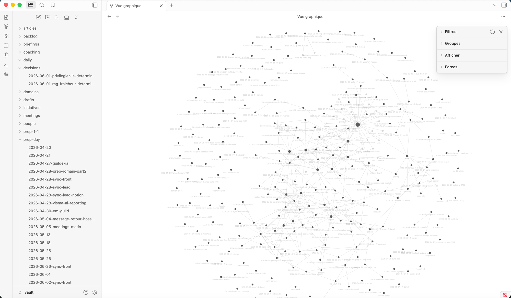
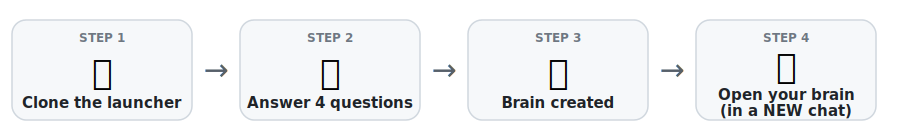

# Kenjaku — Second Brain Generator &nbsp;

*By Thomas Pierrain (VP Tech at [shodo](https://shodo.io/))*

[](https://github.com/tpierrain/second-brain-generator/releases/latest)
&nbsp;[](#keeping-your-brain-up-to-date-its-engine)
&nbsp;[](#and-the-privacy-of-my-data)
&nbsp;[](#ready-to-try-it)

**Ask it like you'd ask a personal assistant — no dev skills required — and pull up any decision or piece of info from your work in seconds, always with the sources.**
*In Claude Desktop or on the command line, your call.*

**🔒 Private by default, search à la carte.** Your notes are indexed **on your machine by default — nothing leaves it**. Or hand the job to the API of your choice, right down to your company's own endpoint: **you decide who touches your data**.

**🛟 Bulletproof & zero chores.** Backup, freshness, recovery after a glitch: **its** job, not yours. *You just have to talk.*

**🔄 Self-upgradable — new in v3.0.0.** Your brain keeps **its own engine** up to date: *ask in plain words, confirm,* and it pulls the latest search engine — **without ever touching a single one of your notes.** No terminal, no re-install. *([how it works](#keeping-your-brain-up-to-date-its-engine))*

**[🧠 What's a second brain?](#what-is-a-second-brain) · [🚀 Install yours now](#ready-to-try-it) · [📖 View the articles](#the-article-series)**

> 🧑 *"Where are we on the billing project — who owns what, and what's been decided?"*
>
> 🧠 *"At the January 15 team sync: the database was settled (PostgreSQL over MongoDB),
> and Jane Doe — platform Tech Lead — is pushing to get ahead of technical debt as early
> as sprint 1.*
> *→ decision of January 10 · → team sync of January 15"*

> 🧑 *"What does 'MEDDIC' mean — that thing the sales team keeps repeating in their meetings?"*
>
> 🧠 *"MEDDIC = the opportunity-qualification method adopted by sales: Metrics, Economic
> buyer, Decision criteria, Decision process, Identify pain, Champion. Introduced by John Smith (VP
> Sales) at the sales kickoff on February 12 to make the forecast more reliable.*
> *→ sales kickoff of February 12 · → sales playbook"*

Instead of digging through Slack, your emails, Google Drive and your meeting notes yourself, you
just ask — and your **second brain** answers right away, with the sources to back it up. It
**retrieves by meaning**, so you can ask in French about notes written in English (or the other way
around).

> ⚠️ This repo is **not** a ready-made brain: it's a **generator** that **produces** a **seed** (a
> skeleton) for you, which you grow into **one of your own**. We explain why below — and that's
> exactly what makes it useful.

---

## What is a "second brain"?

A **memory external to you**: your notes, your decisions and your work exchanges gathered in one
place, that you query in natural language and that answers you **instantly, with the sources to back
it up**.

A few properties define it:

- **It's yours.** Everything lives in a folder of notes (a *vault*) versioned in **your private git
  repo**. You're not renting from an online service: you own your data.
- **It remembers.** Every answer, every new piece of info is persisted (local git commit). Your
  brain builds up an actionable record — and can **follow you from one machine to another** as soon
  as you wire it to a remote repository (optional).
- **It keeps itself up to date — on its own.** Once you've connected your sources (Slack, Drive,
  email, calendar, meeting transcripts…), it **pulls in what's new automatically**, with **no explicit
  request from you**: you never have to tell it to "go sync". When you ask a question, it quietly
  catches up in the background and folds anything new into its answer.
- **It cites its sources.** No answers out of thin air: you can always trace back to the original
  note or message, with its date.

> 📂 **An open, human-readable format.** The substrate of your second brain is just a set of
> **Markdown (`.md`)** files — linked together with `[[wikilink]]` links where it makes sense (a
> note points to a person, a decision, a topic…). Nothing proprietary, nothing locked in.

> 🪨 **Bonus — turn it into a full read/write app with [Obsidian](https://obsidian.md).** The vault
> is **Obsidian-compatible by design**. Install Obsidian (free), point it at your `vault/` folder, and
> you instantly get a **visual reading *and* writing interface** over **every Markdown note in your
> brain**: browse and edit notes, follow the `[[wikilinks]]`, and explore the **graph** of your
> knowledge. Best of all, it's the **exact same files** Claude works on — so whether you ask Claude or
> edit directly in Obsidian, both stay perfectly in sync. Two front doors, one brain, zero lock-in.



> <sub>☝️ A real brain seen in Obsidian — each dot is a note, each line a `[[wikilink]]`. The folder tree on the left (decisions, meetings, people, prep-1-1…) and the graph are *exactly* what Claude reads and writes.</sub>

> 💡 **And honestly — the graph isn't the point.** Pretty as that constellation is, and fun to spin
> around, it's rarely a *useful* view day-to-day. Where Obsidian truly earns its place is as a
> **polished, advanced Markdown reader and editor**: comfortable reading, live preview, instant local
> search — and the freedom to **edit a note by hand** whenever you'd rather type than ask Claude.
> And since these are the very files your brain runs on, anything you tweak in Obsidian is **autosaved
> and automatically re-indexed within seconds** (a live watcher re-embeds the modified note), so your
> brain's search stays current — no "save" button, no "sync", nothing to do by hand.

## Who is it for?

For anyone who's **drowning in scattered information** and wants to retrieve it effortlessly —
whatever their technical level:

- **Managers, Heads of Engineering** — keeping track of their teams, their 1-1s, what's expected of
  them.
- **Product managers, product designers** — keeping the thread of product decisions, trade-offs, the
  "why we settled on it this way".
- **Consultants, researchers, freelancers** — consolidating a business domain, never losing any of a
  client's context.

👉 **No need to be a geek.** This brain is designed for people who **aren't technical** but who
already work with **Claude Desktop** (Code tab). If you can *chat* with Claude, you can use it — and
it works **just as well on Claude Desktop as on the command line** (CLI), your call.

> ⚠️ **Day-to-day use requires no technical skill**: you ask questions, you read answers. Only the
> **installation** (once, ~15 min) assumes you have git and Node (and, *if* you choose the API-key
> option, a key) — we guide you step by step, and an installer checks everything for you.

## How is it different from ChatGPT, Claude, Notion AI or Slack search?

| | What they're missing | What your second brain does |
|---|---|---|
| **Bare ChatGPT / Claude** | Only knows what you re-paste into each conversation. Forgets it all afterward. | A **persistent memory**, that grows with every question. |
| **Notion AI, Slack search…** | Walled into **a single tool**. | **Cross-cutting**: Slack + Drive + emails + transcripts + your notes, all in one place. |
| **Any SaaS** | Your data on a third party, closed format. | **At home**, in Markdown, in **your** private git repo. |
| **"Cloud-only" AI tools** | A **search engine forced on you**: to index you, your notes go off to a third party — with no alternative. | **Semantic search à la carte**: **local by default** (nothing leaves), or delegated to the API of your choice — [you choose](#how-do-i-choose-my-semantic-search-my-rag). |

And above all: this isn't **one** product for everyone. It's a **method** to build **your own**,
tuned to *your* uses (see "*Why a generator and not a finished product?*").

## How is it different from the "LLM wikis" and DIY second brains floating around on social media?

🛠️ **"But a second brain is really just a Markdown folder + a rules file you feed to Claude,
right?"** Done carelessly, it **looks** like it works… then it **fails silently** — the worst kind
of failure, because you don't even notice (nothing's saved, search **makes things up** instead of
searching your notes, the session isn't wired to the right place…). Here, **packaged and tested
guardrails** plug those holes: once installed, **there's nothing left for you to do** — backup,
indexing and freshness all run on their own, without you having to think about them. That's
**affordance**: the complexity is **hidden, not dumped on you**.

**Concretely, all the engineering work runs for you — silently.** Incremental indexing, versioned
backup on **every** change, **atomic** writes, index freshness handled for you, **non-blocking**
startup of the search engine, multi-machine sync, and **deterministic** checks that *prove* the
answer really comes from **your notes** (and not from the Internet). We **designed, tested and
packaged** it to be **robust and reproducible** — not a script that "works on my machine". The goal
we set ourselves: **the only thing left for you to do is talk to your brain in natural language.**
The infra, the storage, the concurrency, the guardrails: that's **its** job — it was built for that
— **not yours**.

> 🛟 **Why such care?** Because building **production-ready** software — that **recovers on its own**
> when something breaks — is a conviction **Thomas, its creator, has carried throughout his whole
> career**, nurtured by **Recovery-Oriented Computing** (ROC — A. Fox & D. Patterson): you **assume
> everything eventually breaks**, and you design so that **recovery** is fast, automatic and **with
> no data loss**. A second brain has to last **years** — not just long enough for a demo.

> 📄 The details (and the full picture — the brain, how it works, the installation, the **RAG à la
> carte**): see the [**How it's different**](EN-QUOI-C-EST-DIFFERENT.md) page.

## What it changes for you, concretely

- **Immediate answer.** In a few seconds, no time to go grab a coffee.
- **Always sourced.** You see where each piece of info comes from, and whether it's recent or not.
- **Nothing gets lost.** Every change is **committed automatically, locally**. And if you wire up a
  **remote repository** (optional, ~2 min — push *opt-in*), everything is also backed up **off your
  machine**: laptop lost or stolen, you pick up where you left off elsewhere.
- **Private by default — and you're the one who chooses.** Your notes are indexed **on your machine**
  by default: nothing leaves. Small machine or Intel Mac? You can delegate to the API of your choice.
  *(To decide: ["how do I choose my semantic search"](#how-do-i-choose-my-semantic-search-my-rag).)*
- **Zero effort on your part.** You never have to kick off a sync, or even know that git exists: you
  ask your question, that's it.

> 💡 For the curious: your answer arrives right away from what your brain already has in memory, and
> updates quietly in the background if it finds something new — a bit like a web page that displays
> instantly then refreshes on its own. The details are in [under the hood](#under-the-hood).

## Not sure what to ask it? Start here

A few opening lines to get going — just talk to it the way you'd brief an assistant. Bonus: each one
is also a quiet way to **confirm a connector is wired up** (the first time it reaches into a given
tool, Claude asks permission — click **"Always allow"**, once).

- **📅 Your calendar** — *"What do I have on tomorrow?"* · *"What does my week look like?"*
  → checks it can reach your **calendar**.
- **📝 Your meeting transcripts** — *"Can you give me a recap of yesterday's product sync — the
  decisions and who owns what?"*
  → checks it can pull in your **meeting transcripts**.
- **✅ What's expected of you (across every source)** — *"What am I on the hook for this week?"* ·
  *"What am I expected to deliver tomorrow?"*
  → gathers the actions assigned to you **across Slack, meeting transcripts and emails**, in one shot.
- **📧 Your emails** — *"Did I get an email from Acme about the renewal?"* · *"Anything I missed from
  the client this week?"*
  → checks it can reach your **inbox**.
- **🧠 Your own notes & decisions** — *"Why did we settle on PostgreSQL?"* · *"Who owns the billing
  project, and what's been decided?"*
  → searches **your vault** — and always answers **with the sources**.

> 💬 No magic keywords, no syntax to learn: phrase it however feels natural, in any language. If a
> source isn't connected yet, it'll simply tell you — see [wiring up your sources](#wiring-up-your-sources-connectors).

---

> 🚀 **Install in one paste — Claude does the rest.** Pick your privacy option, check what you need,
> and copy the single instruction below. ~15 minutes, once.

<a id="ready-to-try-it"></a>

## 🚀 Ready to try it? — install your brain in one paste

**Your only hands-on move:** open Claude and paste this one sentence (adapt the name & URL).

```text
Install me a second brain named "second-brain" (name to be confirmed) from this generator: https://github.com/tpierrain/second-brain-generator
```

That's the whole manual part — **no cloning, no commands, no key to wrangle in chat.** Claude does
everything else for you. Here's what happens behind the scenes 👇

> 👉 **The one thing to keep in mind:** what you're pasting into right now is the **installer**. Your
> **second brain is a *separate place*** that Claude opens for you at the very **end** — you don't ask
> it questions *here*. That last hop (open your brain in a **brand-new** conversation) is the single
> step people miss — we flag it loud and clear when you get there.



<a id="how-do-i-choose-my-semantic-search-my-rag"></a>

### 🧭 How do I choose my semantic search (my RAG)?

This is **the** privacy choice, and it boils down to one question: *who's allowed to read your notes
to index them?* Three answers — and you can **change your mind whenever you want** (we re-index in a
few minutes, nothing is lost):

| Option | Engine & model | For whom | Privacy | Cost |
|---|---|---|---|---|
| 🟢 **On your machine** *(recommended default)* | 📱 **EmbeddingGemma-300M** (local, ONNX) | Machine with ≥ 12 GB RAM, not an Intel Mac | **Nothing leaves** your computer | Free |
| 🟡 **With an API key** | **`gemini-embedding-001`** — or OpenAI / Mistral / OpenAI-compatible | Small setup, or Intel Mac | Your notes go through the provider — Gemini, OpenAI, **your company's endpoint** | ~€0.10 / 1,000 notes · ~€1 / 10,000 |
| 🟢 **Ollama, locally** *(advanced)* | Any Ollama model — e.g. **`bge-m3`** | Comfortable installing an app | **Nothing leaves** either | Free |

> 📱 **Why "on your machine" is so light:** **EmbeddingGemma** is Google's embedding model **designed
> to run on-device — even on a phone**. So it sits comfortably on a laptop, with nothing leaving it.

> 💶 With an API key, Gemini's **free** tier is enough to get started. Depending on the provider & plan,
> pick the right settings so your notes aren't used for training (e.g. enable billing — a few cents per
> year — or a "no-training" / data-controls option). Details: [SETUP §9](SETUP.md).

At install time, Claude presents the 3 options and **recommends based on your machine**; with no
preference, the local default applies on its own if the machine can handle it. *(The "how it works":
["the RAG à la carte"](#-the-rag-à-la-carte--you-choose-who-vectorizes-your-notes).)*

### 📦 What you need

- **[Claude Code](https://claude.com/claude-code)**, **[Node.js](https://nodejs.org) ≥ 20** and
  **git**. *(The installer checks everything — Node version included, with an actionable message — if
  one is missing or out of range, it tells you cleanly.)* Node 24/25/26 are supported since v3.1.0.
- **For semantic search**: nothing more if you go with the **local** option (the recommended
  default), or an **[API key](https://aistudio.google.com/apikey)** if you choose that option — see
  ["how to choose"](#how-do-i-choose-my-semantic-search-my-rag) above.
- **Your information sources** (Slack, Drive, emails, Notion, transcripts…), to wire up according to
  *your* tools. Optional to begin with. *(see [SETUP §6](SETUP.md))*

### ⚙️ Installation — Claude installs everything for you

You use Claude Code and you have the generator's URL? Let **Claude install everything for you** —
that's the only move you make. Open Claude Code in **any empty folder on your machine** (a temporary
working directory will do — it's just where the launcher gets cloned), and **copy-paste this single
instruction** (adapt the name and URL):

```text
Install me a second brain named "second-brain" (name to be confirmed) from this generator: https://github.com/tpierrain/second-brain-generator
```

> 📍 **And my brain, where does it land?** **Not in this current folder**: by default it's created in
> your home (`~/<name>`). The directory you launch Claude from only serves to host the (disposable)
> clone of the launcher. For another location, specify it in the instruction ("…in `~/brains`") — no
> need to put yourself there.

That's it: no need to say "don't touch the launcher" or "don't ask for my key" — **the generator
enforces safety itself** (the launcher stays read-only, the brain is a fresh folder with no remote
link, the key is never asked for in chat). Claude clones the **launcher**, asks you **in chat** the
few questions (brain name, location, your name, language), then runs the installer in non-interactive
mode — which **creates the brain folder** and does **everything** (copy, generated files, `git init`,
RAG engine, verification). The install can't **half-succeed**: either it goes all the way and
**proves it to you** (it verifies for itself that search really answers from your notes), or it
**stops dead and tells you why** — **never a ghost install** that looks OK but doesn't work. That
leaves you **3 moves**:

1. **🔑 A key to paste — only if you chose the "API key" option.** With the local option (the default),
   **you skip this move**, nothing to paste. Otherwise, Claude guides you to paste your key into
   `.env` (never in chat) — details [SETUP §1.1](SETUP.md).
2. **💾 Remote repository?** Claude will ask whether you want a **remote** git repository (backup +
   multi-machine). **Saying no is risk-free**: everything stays versioned locally, nothing is lost,
   and auto-commit **pushes nowhere** (push opt-in disabled by default). You can add one later.
3. **🧠 Leave the installer — open your brain in a *brand-new* conversation.** Not this one: start a
   **new** conversation (CLI) / **new session** (Desktop) **in the brain folder that was created**
   (e.g. `~/second-brain`) — *that* is what activates the search engine. ⚠️ **Just switching the
   folder of *this* conversation won't work** — it has to be a new one. (The installer itself can be
   reused for another brain or deleted.)
   👉 **This is the step most often missed on Claude Desktop — see just below.**

#### 🖱️ On Claude Desktop (Code tab): opening your brain in the RIGHT place

This is **the** #1 trap, and it's not obvious at all. Your brain only "works" if the conversation is
**properly opened in its folder**. Starting a *New session* isn't enough: by default it reopens on
your last folder (often a `tmp`), and Claude then **makes up answers** instead of searching your
vault.

The setting is made with **the row of little chips at the bottom, just above the input field**:


1. Open a **New session**.
2. **Click the FOLDER CHIP** (the one showing `tmp` or some other name) — ⚠️ **NOT** the
   `➕` "Add another folder" button: that one *adds* a folder **without replacing** the root, and the
   brain doesn't load. That's the classic trap.
3. A **"Recent"** menu opens, with a **✓ on the current folder**. **Click your brain's name** (e.g.
   `second-brain`). If it's not listed, take **"Open folder…"** at the very bottom.


4. The **✓ jumps to your brain**, and the bottom chip shows its name (no more `tmp`). ✅
5. **Double-check in one word**: type `pwd` as your very first message → it should return the path of
   your brain, **not** a `…/tmp`.

> ⌨️ **On the terminal (CLI)**, it's foolproof: `cd ~/second-brain && claude` — the session opens
> directly in the right folder, no ambiguity.

Once installed, try something like:

> *"At the outfit that helps folks quit overworking, which worker got publicly honored for having loafed the most of anyone — and at what percentage?"*

Claude searches your vault and answers with links to the source notes. **Correct answer: Pélagie de
Mollecuisse, winner of the Inertia Trophy with a DNR of 98.7%** — a fact **impossible to find
outside your vault** (the company "Flemmr" is made up). If Claude gives you that, you have **proof**
that it really queried your brain and not the Internet. If it answers that it doesn't know this
company, then the RAG isn't running.

> 💡 Why this question **always** works: the subject is **made up**, so Claude has no answer in memory
> → it's *forced* to query the vault (for a public topic like Star Wars, it would answer off the top
> of its head without searching). And the question **describes** the situation through synonyms: none
> of its words appear in the notes → a plain "search the files" (grep) would fail. If "Mollecuisse"
> comes out anyway, it means search made the connection **by meaning**.

> 🧪 **The example notes.** The vault ships with a few demo notes around a **made-up parody company**
> (Flemmr, which "industrializes procrastination") — just enough for the first question to work right
> away, and **impossible to confuse** with real work notes. Keep them as templates, or wipe them when
> you start your real vault (delete the files in the `vault/` folder, or rerun the installer in
> interactive mode, which offers to empty them).

### Behind the scenes of the installation — launcher vs brain

*(For the curious — you don't need to understand this to use it.)*

**One launcher, one brain — two folders.** You give **one single instruction** to Claude; it takes
care of fetching the **launcher** (this generator) and **creating a separate brain folder** where it
puts everything. The launcher is **never modified**: it stays **read-only** and **reusable** — one
launcher can generate several brains.

```
You give ONE instruction to Claude Code:
        │   "Install me a second brain named "second-brain" (name to be confirmed)
        │     from this generator: https://github.com/tpierrain/second-brain-generator"
        ▼
    📁 second-brain-generator/   ← the LAUNCHER (Claude clones it): read-only, reusable, never modified
        │
        │   Claude runs the installer in it  →  which CREATES a folder ELSEWHERE
        ▼
    📁 ~/second-brain/            ← YOUR second brain: a FRESH folder (files copied + git init)
        ├── CLAUDE.md          (your constitution — generated from the bootstrap stub)
        ├── vault/             (your notes)
        ├── rag/               (the search engine)
        ├── .git/              (FRESH repo, 0 remote — no link to the launcher)
        └── .mcp.json, .env …  (generated config)
        │
        │   you reopen Claude Code INSIDE the brain
        ▼
    → you ask your questions
        │
        │   (optional, whenever you want) you ask Claude, INSIDE your brain:
        │   "Push my second brain to a remote GitHub repository (for a backup)"
        ▼
    ☁️  remote repository        ← backup + multi-machine (push opt-in, see § Backing up)
```

To clear up the doubts we all have at first:

- **The launcher is not your brain**: it's the tool that **produces** it. Keep it to generate
  others, or throw it away — your brain lives in **its own folder**.
- **No link to the launcher**, by construction: the installer **copies** the files into a fresh
  folder then runs `git init` in it (0 remote). Nothing to "detach" yourself.
- **`--name` = the name of the created brain folder**; its location is chosen with `--dest` (by
  default, your home → `~/<name>`). The installer **refuses if the folder already exists**.
- The brain is born **without a remote repository**: for backup / multi-machine, you wire up YOUR
  repo later (push opt-in, see move 2 above).

### 💾 Backing up your brain & using it on multiple machines (optional)

By default, your brain is **versioned locally** (every change is committed automatically) but **stays
on your machine** — nothing goes elsewhere. To have an **off-machine backup** and/or use it **from
several computers**, wire it to a **remote git repository**: **GitHub**, GitLab, Azure DevOps, or
your own git server.

- **During installation**: Claude **offers it directly** (move 2) and configures everything.
- **Later**: three commands (`git remote add` → `git push -u` → enable auto-push), step by step in
  [SETUP §7](SETUP.md).

It's **opt-in**: as long as you haven't wired it up, **nothing is pushed** (anti-leak guardrail by
default). You can do it right away **or weeks later**, without breaking anything. Once in place, the
auto-commit hook **pushes on every change** — backup and switching between laptops become seamless.

<a id="keeping-your-brain-up-to-date-its-engine"></a>

## 🔄 Keeping your brain up to date (its engine)

> 🆕 **New in v3.0.0.** Brains generated from **v3.0.0 onward** ship with this built-in updater — so
> they keep improving long after install day, opt-in and on your say-so.

Your brain runs on an **engine** — the search code, the launchers and a handful of housekeeping
scripts. Over time that engine improves (faster search, new safeguards, fixes). The good news:
**your brain knows how to upgrade its own engine — and it never touches a single one of your notes.**

A few plain ideas first (the mental model):

- **The launcher was a one-time thing.** You used the installer (the *launcher*) **once**, on install
  day. To upgrade later you **don't re-run it**, and you **don't start over from a fresh launcher
  folder** — you don't even reopen it.
- **Your brain carries its own updater.** Every brain ships with a small built-in updater
  (`update-engine`) that travels **inside** the brain. Upgrading is just asking your brain to use it.
- **`engine-manifest.json` is the map.** A readable file in your brain that spells out exactly *what
  counts as the engine* — and records *where* a newer engine can be pulled from (the launcher's
  address + the exact version your engine was built from). It's how the brain tells what is "engine"
  (upgradable) from what is **yours** (off-limits).
- **An upgrade is a throw-away errand.** When you accept one, the brain fetches a **temporary,
  disposable copy** of the newer engine into a temp folder, takes only the engine pieces it needs,
  applies them, then **deletes that temp folder.** Nothing lingers, no new folder left on your machine.

**What you actually do — nothing technical:**

> 🧑 *"Update your engine, please."*
>
> 🧠 *"You're on engine v3.0.0; v3.1.0 is available — want me to update? Your notes won't be touched."*
> → you say **yes**.

That's the whole thing: **ask in plain words, confirm.** No terminal, no installer, no new folder.
(Because your brain can *see* its own version, it may even **offer** the update on its own.)

**Sacred — never touched by an update:** your **notes**, your `.env` (keys), your **`CLAUDE.md`**
constitution, your **settings** and your **custom skills**. An update only ever swaps **engine**
files, and it **re-indexes only if** the new engine changed the index format (a few minutes) —
otherwise your search keeps working untouched.

> 🔧 **What you need at upgrade time** (same as install): **git**, **npm** and a **network**
> connection — the brain briefly reaches out to fetch the newer engine. *(That `npm` step just
> installs the search engine's **dependencies on your machine**; it does **not** pull your brain from
> any app store or central registry — your brain stays **self-hosted**, exactly as it was generated.)*

The hands-on steps (and how to run it yourself, if you're technical) are in
[SETUP §10](SETUP.md).

## 🧬 Already have a brain from *before* v3.0.0? Bring your notes over

> 🆕 **New in v3.1.0** — the **first feature delivered *on* the v3 platform.** Brains born **before
> v3.0.0** have no built-in updater (the self-upgrade above only exists from v3.0.0 on), so the path
> to v3 is: **install a fresh brain, then *import* your old notes into it.** That import is now a
> conversation — no manual copy-paste, no footgun.

**What you do — in plain words:**

1. **Install a fresh brain** the normal way (the one-paste install above) — it's a **3.1.0** brain.
2. **Open a NEW conversation rooted in it** (the install hand-off banner walks you through this).
3. Say: **_"importe mes anciennes notes depuis `<chemin-de-mon-ancien-cerveau>`"_** (or *"import my old
   second brain from `<path>`"*). Your brain shows a **safe plan**, asks you to **confirm**, copies your
   notes, and re-indexes them.

**It's safe by construction:** it copies your notes (and their attachments, with subfolders preserved)
**only** — never the old engine — and it **never overwrites** an existing note (a name collision is
*skipped* and reported). Demo notes don't travel.

> ⚠️ **The one footgun, said plainly:** point it at your **old brain folder** — don't try to copy the
> *whole* folder by hand into the new one (that's what used to clobber the new engine). The import
> brings the **vault content**, nothing else.

A couple of manual follow-ups it will remind you of: if your old brain had a **personalised
`CLAUDE.md`** (constitution), that is *not* auto-merged in v1 — it'll offer to help you fold it in by
hand; and your **`.env` keys / connectors** belong to the new brain (set up at install), so re-wire any
old ones separately.

> 🧬 *We nickname this the **Kenjaku** move — transplanting a mind into a new vessel. That's just
> flavour: **you never need to say the word** — ordinary phrasing ("importe mes anciennes notes…")
> triggers it.*

## And the privacy of my data?

A fair question: your vault can be **confidential**. Depending on the search option you chose, **one
or two** services may see your content — and **in every case, the right plan/settings keep it from
being used for training** (and in fully-local mode, the indexing engine sees **nothing**):

- **Claude** (which reasons and answers) reads your vault. On **API / Team / Enterprise**, your data
  is **not** used for training. On the **consumer** plan (claude.ai Free/Pro/Max), go to
  **Settings → Privacy** and **uncheck** the use of your conversations for model improvement.
- **The indexing engine** receives the **text of your notes** — *only* if you chose the **API key**
  option (Gemini, OpenAI, company endpoint). With the **local** or **Ollama** option, **nothing
  leaves**: your notes never leave your machine. ℹ️ And if you go through **Gemini on the free tier**,
  Google **may use** that content to improve its products (human review possible): **turning on billing
  / data controls** keeps it out of training (Google then commits to **not** using it for training).

**The most private is also the recommended default** (fully-local); and even with the key option, for
the price of a coffee a year your data leaves the training scope. Details and pricing chart:
[SETUP §9](SETUP.md). *(Providers' terms change: check them.)*

---

## Why a *generator*, and not a finished product?

Because a second brain is **personal**. What serves a Head of Engineering, a salesperson or a
researcher has **nothing in common**. A single tool for everyone would be bland for each of them.

So this repo gives you **the ready-to-use machinery** (the search engine) and **a method** — the
*use case driven* approach of **Thomas Pierrain** ([his article series](#the-article-series)) — to
let **your own uses emerge** as you ask questions. You start from a seed; you grow it by using it.

**Everyone has their own instance.** A colleague who wants theirs **starts from the same launcher**
and **generates** their own brain. You don't share one second brain between several people — you
share the generator.

That's also why the `CLAUDE.md` (the rules Claude follows) is **your constitution**, specific to
*your* uses: the installer **generates** it custom for you. The launcher only contains a **bootstrap
stub** that signals to Claude that it's still a generator (and guides you to the installer); the
installer **generates your real constitution in the brain folder** — and **never** touches the
launcher's bootstrap stub (which stays reusable).

## Safe by construction: it observes, it answers

Your second brain **takes no action** on your tools. It **reads and it answers**, period. No
surprises, nothing going out in your name: it's a design choice, and it's what makes it easy to adopt
with peace of mind.

> And if one day you want it to: as you grow it, we can add **action capabilities** (a draft email, a
> Notion page, a Slack message to approve…), **deliberately and under your control**. Never by
> default, never behind your back.

## Tailor it to your use cases

A second brain is only worth anything **tuned to your activity**: your needs, the kind of questions
you ask, the kind of exchange you want to have with it. *You're* the one who defines that.

It **arrives already equipped** with a few **ready-to-use skills** — for instance an **"in-your-face"
coach** in the spirit of *Radical Candor* (brutally honest **and** caring), who challenges you when
you've got your head down in the weeds. But these are only **starting points**: the whole point is
that it stays **flexible**. Notes in **open Markdown**, skills, the `CLAUDE.md` constitution — **its
entire structure has been thought out and arranged to be reshaped** to *your* uses: you add, modify or
remove skills, you refine its rules, as you go. It **grows with you**; it doesn't force you into a
mold.

**Example — for Thomas Pierrain, *Head of Engineering*** — his second brain helps him to:

- **keep track of his collaborators**, the people he coaches and mentors;
- **get himself challenged** when he's got his head down in the weeds, in a role where you can
  sometimes feel alone;
- **consolidate advanced client business concepts** (here accounting and taxation);
- **tell business acronyms apart from application acronyms** — quickly recover the meaning mid-meeting,
  without interrupting everyone;
- **map out the teams**: who owns which topic, at any moment;
- **always know what's expected of him, and what he expects from others**.

None of that is shipped: those are **his** specifics. The generator doesn't try to replicate them —
it gives you the engine and the method to let **your own** emerge.

## The article series

The "why" behind this repo — to be read in order, each episode tells one step (and its owned-up
missteps):

1. [My second brain pivoted twice in 3 days](https://medium.com/@tpierrain/my-second-brain-pivoted-twice-in-3-days-0e6a723faf34)
2. [I hired a no-bullshit coach in my second brain](https://medium.com/@tpierrain/i-hired-a-no-bullshit-coach-in-my-second-brain-e7b1ce5702c5)
3. [Why my second brain was talking without understanding](https://medium.com/@tpierrain/why-my-second-brain-was-talking-without-understanding-103d5c305341)
4. [Embeddings and RAG explained to my parents](https://medium.com/@tpierrain/embeddings-and-rag-explained-to-my-parents-006f76dd4c14)

---

## Under the hood

*This section is for the curious and the technical. You don't need to read it to use your second
brain.*

### The design stance: answer right away, verify afterward

Everything is designed **experience first**: you want an answer in a few seconds to *every* question
— not to wait for an agent to finish re-digging through all your tools.

So the second brain **answers immediately** from what it already has in memory (the vault), via
**semantic search** (it finds a note even when phrased differently, not by exact keywords). While
you're reading, agents **re-verify in the background** the external sources and only **amend** the
answer if there's something new. It's the *stale-while-revalidate* pattern from the web applied to
your memory: speed comes first, freshness follows.

On every question, the brain **catches up**: it pulls in what's happened anew since last time (in
**delta mode** — only the new bits) and persists everything in the Markdown vault, versioned by git.

### The 4-phase flow

```
Question
   │
   ▼  PHASE 1 — Immediate answer from the vault (semantic search)
   │
   ├──▶ PHASE 2 — (optional) Sync external sources in the background
   │
   ▼  PHASE 3 — Amend the answer if something new is found
   │
   ▼  PHASE 4 — Persistence: everything is saved in the vault + auto-commit
```

The **RAG engine** splits each note into *chunks* (one per section), turns them into vectors
(*embeddings*) and retrieves the passages closest to the **meaning** of your question. The index
rebuilds itself, incrementally; a git hook **commits** on every change (and **pushes** only if you've
wired up a remote repository — *opt-in*).

#### 🍽️ The RAG à la carte — you choose who vectorizes your notes

Vectorization (the *embedding*) is **the only moment** when the text of your notes can leave your
machine — so we make it **a conscious choice**, not a default you're stuck with. The **embedding
engine** (the *embedder*) is interchangeable: a small **local** model (by default), an **API key**
(Gemini, OpenAI, or a compatible endpoint — including your company's), or **Ollama** locally. The
decision table is higher up, in
["how do I choose my semantic search"](#how-do-i-choose-my-semantic-search-my-rag).

> 🧠 The embedder is **not** "ChatGPT at home": it's just the librarian that files your notes by
> meaning. **The brain that reasons and answers you stays Claude**, whatever your choice.

### What's in the box

| Element | Role | Status |
|---|---|---|
| **`rag/`** | RAG engine (TypeScript MCP server): chunking, embeddings **à la carte** (local / API key / Ollama), semantic search, quota guardrails | ✅ ready to use |
| **`vault/`** | Your Markdown content (example notes included) | 🔧 to fill in |
| **`CLAUDE.md`** | The rules Claude follows (4-phase flow, conventions, posture) | 🌱 bootstrap stub in the launcher → the installer **generates** a personalized version **in the brain**, then to be tailored |
| **`.claude/skills/`** | Shipped skills (see below) + ideas for other skills | 🔧 to flesh out |
| **`.claude/settings.json`** | Hooks (auto-commit, startup status) + permissions | ✅ generated |
| **`scripts/*.mjs`** | Cross-OS Node hooks: repo + RAG state at startup, auto-commit | ✅ ready |
| **`installer.mjs`** | Installer: **creates the brain folder** from the launcher (macOS / Linux / Windows) | ✅ |

### The skills you call

The generator stays deliberately **frugal**. The ones you invoke day to day:

| Skill | What it does |
|---|---|
| **`/coach`** | **"In-your-face" coach**, a sparring partner wired to your vault, *Radical Candor* spirit (caring AND brutally honest): it challenges your decisions, names your blind spots. *Self-coaching only.* |
| **`/prepare-1-1`** | Prepares a 1-1 **both ways**: with **your manager** or with someone **you manage** (tracking commitments, KPI review). Cross-references the person's profile + last 1-1 + recent signals. |
| **`/improve`** | Evolves your harness: reads the frictions, proposes and applies the useful improvements. |
| **`/sync`** | Syncs your repo between machines — useful mostly if you have **several laptops**. Rarely needed day to day. |

### The internal tooling (you don't call it)

These elements are part of the machinery: you don't have to know them. It's just good to know they
exist.

| Element | Role | What triggers it |
|---|---|---|
| **`sync-sources`** | Pulls the **delta** of external sources in parallel **read-only** sub-agents — the engine behind Phase 2. 🔧 to wire to your connectors. | **your questions** (never you) |
| **auto-commit hook** | **Commits** your vault on every change (and **pushes** it if you've enabled a remote repository — *opt-in*, off by default). This is what means a **non-technical** profile **never has to know git** — everything is versioned on its own, locally, nothing gets lost; wire up a remote repository and you switch laptops without a thought. | automatic |
| **`tdd-discipline`** | Vendored TDD discipline — used to develop *the harness itself*. | Claude, when modifying the harness |

The rest is **not shipped**: those are **skill ideas** to let emerge as you need them, detailed in
[`.claude/skills/EXAMPLES.md`](.claude/skills/EXAMPLES.md). For example: `briefing-journee` (morning
briefing), `briefing` (recap after an absence), `prepare-meeting`, `rapport-etonnement`,
`weekly-review`.

> **Skill ≠ connector.** Slack, Drive, Notion, Calendar are **connectors** (data sources), not
> skills. You wire them up in the installer ([SETUP §6](SETUP.md)). A *skill* is a procedure that
> leverages these sources — it's up to you to write it.

### The vocabulary in 30 seconds

<details>
<summary>Unfold the mini-glossary</summary>

- **Vault** — the folder where your notes live (in Markdown).
- **RAG / semantic search** — the tech that finds a note by the *meaning* of your question, not by
  exact keywords.
- **Embeddings** — the translation of a text into numbers, to compare *meanings* with each other.
- **Skill** — a procedure you trigger (e.g. "prepare my 1-1").
- **Connector** — a hookup to one of your sources (Slack, Drive, Notion…). Two forms: **native**
  (enabled in your Claude account settings) or **MCP** (a server declared in `.mcp.json`).
- **Harness** — the set of rules (`CLAUDE.md`) + skills that you personalize.
- **Hook** — an automatic action triggered by an event (e.g. save on every change).
- **Installer** — the program that sets everything up for you.
- **Repo / git** — the versioned place where everything is stored and backed up.

</details>

---

## Wiring up your sources (connectors)

The RAG engine answers from **your notes**. For it to also be able to search your **other sources**
(email, calendar, Notion, files, chat…), you wire up **connectors**.

**Two ways to wire up a source — that's what "native" vs "MCP" means:**

- **_Native_ connector (claude.ai)** — an integration **provided and hosted by Claude**, that you
  enable in a few clicks in **your Claude account settings** (*Settings → Connectors*). **Nothing to
  install or configure** in your brain. The simplest — that's the case for Gmail, Google Calendar,
  Slack, Google Drive, Notion.
- **_MCP_ server (community)** — a small program (often an `npm` package) that **you declare
  yourself** in your brain's `.mcp.json` file, with your credentials. More choice and control, but a
  bit more configuration. The installer's wizard can add it for you.

> 👉 When a source exists in **both forms** (Notion, Drive…), start with the **native** one: less
> friction. Move to **MCP** if you want a specific variant or a tool with no native connector.

A few ideas to get started — *up to you to choose according to your tools*:

| You want to query… | You could for example wire up… | Type |
|---|---|---|
| Your Notion **notes / wikis** | the Notion MCP server `@notionhq/notion-mcp-server`, or the **native** Notion connector | native **or** MCP |
| Your **emails** | the **native** **Gmail** connector | native (claude.ai) |
| Your **calendar** | the **native** **Google Calendar** connector | native (claude.ai) |
| Your **files / documents** | a Google Drive MCP server (`@modelcontextprotocol/server-gdrive`, `@isaacphi/mcp-gdrive`…), or the **native** Drive connector | native **or** MCP |
| Your **team chat** | the **native** **Slack** connector | native (claude.ai) |
| Your **meeting transcripts** (Meet) | the **Calendar** *and* the **Drive** — see below | native + MCP |

> 🎙️ **Meeting transcripts aren't a separate connector.** When you record a video call (Google Meet /
> Gemini), the transcription link often ends up in the **event invitation** (→ via the **Calendar**)
> and the transcription document lands on your **Google Drive** (→ via the **Drive**). So you catch
> them by wiring up **those two connectors**, not a third-party meeting-bot tool.

The **installer's wizard** (step 5/9) offers to wire all this up by showing you, for each source,
*what it's for*. The full menu and the credential details are in [**CONNECTORS.md**](CONNECTORS.md)
and [SETUP §6](SETUP.md).

## 📝 Notes for Claude Desktop users

A couple of things that surprise people running their brain from the **Claude Desktop** app:

- **One warm engine per open brain.** The brain's search engine (the `vault-rag` MCP server) lives
  with the **parent `claude` session**, not with your typing — Claude Desktop keeps it alive in the
  background as long as that brain conversation is open, even between your messages. Each open brain
  conversation therefore holds **one warm embedder in RAM**. If you juggle several brains at once and
  your machine feels tight, **close the brain conversations you're not using** to free that memory.

## What's next?

The seed gives you the **engine** and a **harness skeleton**; *your* second brain, you grow it by
using it — your notes, your rules, your skills. To go further:
[`.claude/skills/EXAMPLES.md`](.claude/skills/EXAMPLES.md) (skill ideas) and
[SETUP.md](SETUP.md) (connectors, troubleshooting, RAG details).

## About

By **Thomas Pierrain** — find the "second brain" series and his other writings on
[medium.com/@tpierrain](https://medium.com/@tpierrain).

## License

[Apache License 2.0](LICENSE) — Copyright 2026 Thomas Pierrain.

You can use, modify and redistribute it freely, **including commercially**, provided you **keep the
attribution**: keep the copyright notice, the [`LICENSE`](LICENSE) file and the contents of the
[`NOTICE`](NOTICE) file in any copy or derivative work, and flag the files you've modified. The
license also includes a grant of patents.

---

<p align="center"><sub>Made with 🧠 by <strong>Thomas Pierrain</strong> — VP Tech at <a href="https://shodo.io/">shodo</a></sub></p>
