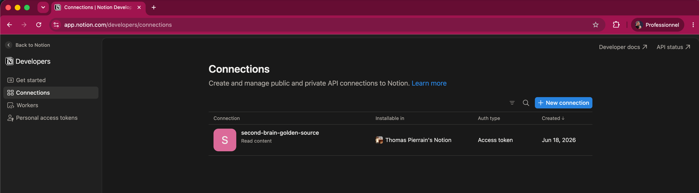
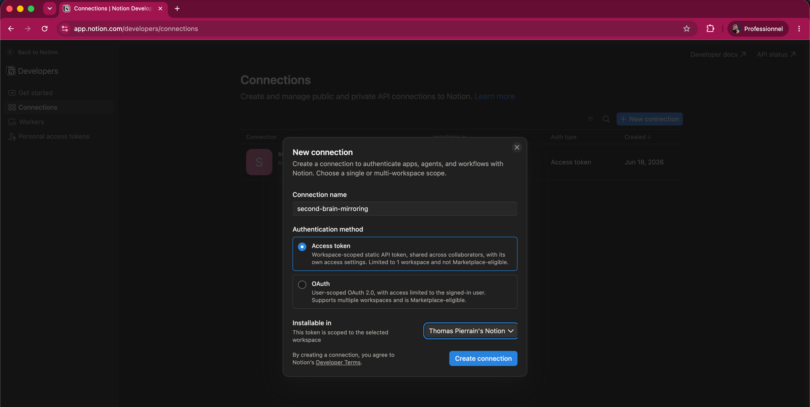
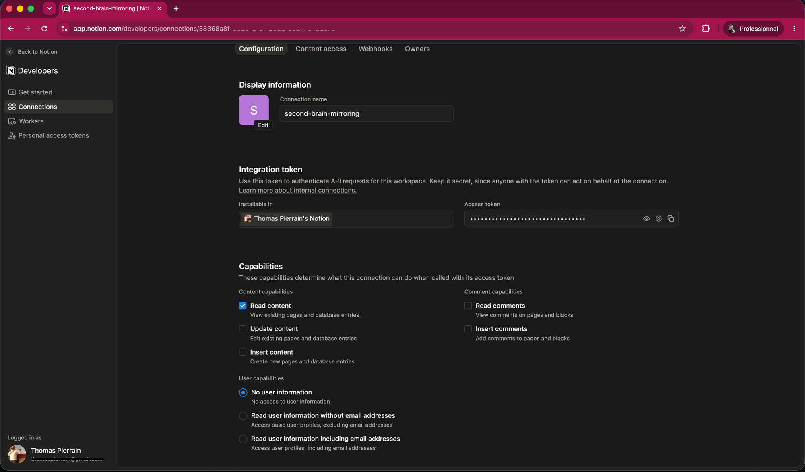
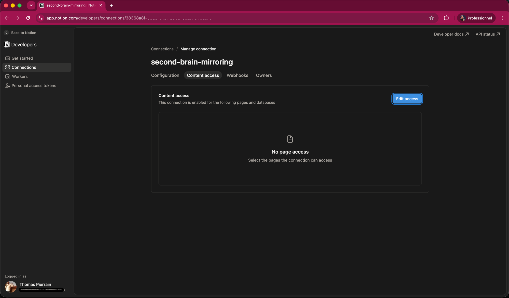
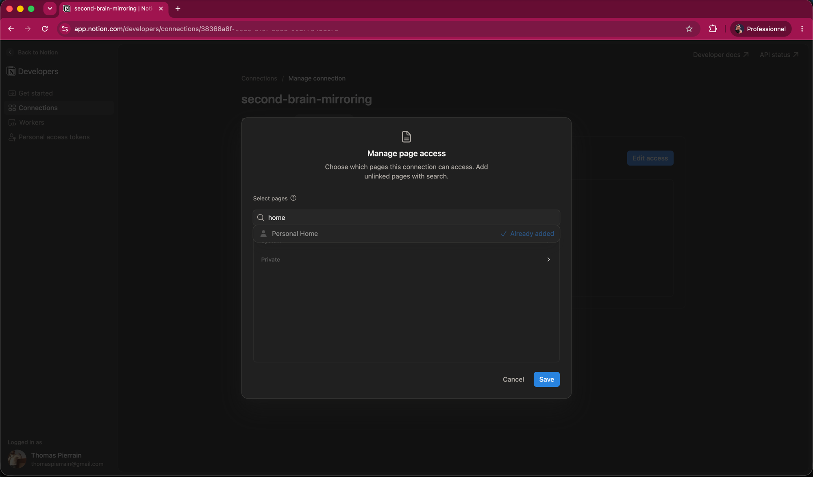
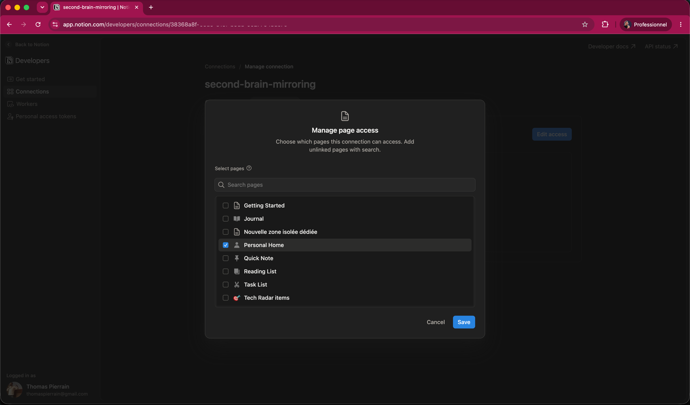
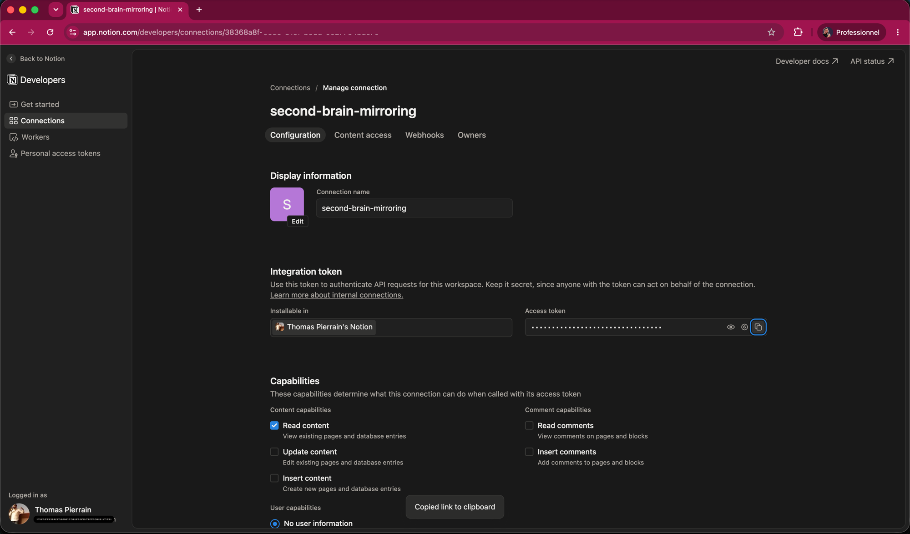

# Create a Notion token — step by step (for your local mirror)

To mirror a Notion zone into your second brain (a **[local mirror](../CONNECTORS.md#-local-mirrors--mirror-a-live-source-into-your-vault--a-search-connector)** —
see the connectors doc),
the brain needs a **Notion connection token**: a secret key that lets it **read** the pages you
explicitly share with it — nothing else. (Notion's developer portal calls these **connections**; you may
still see the older word *integration* in places — same thing.)

This guide walks you through it **click by click**. It takes about **3 minutes**. No coding.

> 🔒 **The token is a secret.** It goes **only into your `.env` file** — never paste it into the chat,
> never commit it, never send it to anyone. Your brain reads it straight from `.env`.

---

## What you'll end up with

- A **connection** with an **Access token** in your Notion workspace (a read-only robot account).
- The connection **granted access** to the root page(s) of the zone you want to mirror.
- Its **token** copied and pasted into your brain's `.env`.

Skip the *grant access* step and the first sync returns **0 pages** — so don't skip it.

---

## Step 1 — Open the Connections page

Go to **<https://app.notion.com/developers/connections>** and sign in with the same account you use for
Notion. This is Notion's **Developers → Connections** area — a *connection* (Notion's current name for
an integration) is the read-only robot that will access your pages.



---

## Step 2 — Create a new connection

Click **“+ New connection”** (top-right). In the dialog:

- **Connection name:** something you'll recognize, e.g. `second-brain-mirroring`.
- **Authentication method:** choose **Access token** — a simple, workspace-scoped static token.
  *Leave **OAuth** alone* — that's for multi-workspace published apps, not what you need here.
- **Installable in:** pick the workspace that holds the pages you want to mirror.

Then click **Create connection**.



> 💡 **Read-only is all your brain needs.** The connection only ever *reads* Notion — the local mirror
> mirrors pages **in**, it never writes back. If Notion asks about capabilities, **“Read content”** is enough.

---

## Step 3 — Keep the capabilities read-only

Creating the connection drops you on its **Configuration** tab. Under **Capabilities → Content
capabilities**, only **“Read content”** is ticked — leave **“Update content”** and **“Insert content”**
**off**. That's all your brain needs: the local mirror only ever *reads* Notion. (You can also see the
masked **Access token** here — you'll copy it at the end, in Step 6.)



---

## Step 4 — Open “Content access” and click “Edit access”

The token alone can read **nothing** yet — you must tell the connection **which pages** it may read.
Open the **Content access** tab. It starts at **“No page access”**. Click **“Edit access”**.



---

## Step 5 — Pick the root page(s) to mirror, then Save

The **Manage page access** dialog opens. **Search** for the root page of your zone (or tick it in the
list), select it, and click **Save**.





Sub-pages **inherit** this access automatically — granting the root page is enough for the whole
sub-tree.

> ⚠️ **This is the step everyone forgets.** Without it, your brain's first sync returns **0 pages**
> (the token is valid but sees no pages). If you get 0 pages, come back and add your page here.

---

## Step 6 — Copy the Access token

Go back to the **Configuration** tab. Next to **Access token**, click the **copy** icon — Notion
confirms with **“Copied”**. The token starts with **`ntn_`**.



> 🔒 **Keep it safe.** Treat it like a password. Until you paste it into your brain (next step), store it
> in a **password manager / secrets vault** — never in a chat, an email, or a plain note. If it ever
> leaks, come back here and **regenerate** it.

---

## Step 7 — Paste the token into your brain's `.env`

When you ask your brain to *“set up a local mirror of a Notion zone”*, it **opens your `.env` file** on the
right line for you. Paste the token right after the `=`, then **save** (⌘S on macOS, Ctrl+S on
Windows/Linux):

```dotenv
NOTION_TOKEN_PASC=ntn_xxxxxxxxxxxxxxxxxxxxxxxxxxxxxxxxxxxxxxxx
```

(The variable name — here `NOTION_TOKEN_PASC` — is whatever your brain chose for this source; use the
exact line it opened.)

That's it — tell your brain it's done, and it will run the first sync.

---

## Troubleshooting

| Symptom | Cause | Fix |
|---|---|---|
| First sync returns **0 pages** | The connection has no access to the root page | Redo **Steps 4–5** (Content access → Edit access → tick your page → Save), then re-run the sync |
| **401 / unauthorized** error | Wrong or expired token in `.env` | Re-copy the token (**Step 6**), paste it again, save |
| Some pages are **missing** | They live in **another Notion space / tree**, merely *linked* from the zone | Expected — only the root page's sub-tree is mirrored (a link is not a local copy) |
| Attached **PDFs / Google Slides** aren't searchable | Only the page's **Notion text** is mirrored; embedded files aren't extracted | Expected limitation — paste the key facts into the Notion page as text if you need them indexed |

---

> Maintainers / screenshots: the images above live in [`docs/img/`](img/) as `notion-token-01..07.png`.
> Keep the filenames so the links don't break.
