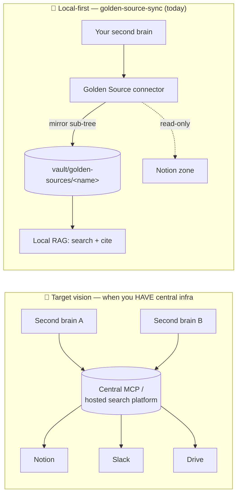

# Golden-source post-fixes — action plan to ship (QA → merge)

> Closes the **post-fixes QA round** (fresh brain `gss-qa-fresh`, 2026-06-18). Source of findings:
> `golden-source-qa-postfixes-feedback.md` (FR scratch journal). This plan turns the 3 new findings
> (Obs 3/4/5) into green, TDD baby-steps, then ships the `golden-source-sync` branch up to merge.
>
> **Branch:** `golden-source-sync` (committed, **NOT pushed**). Push/merge/tag **only on Thomas's
> explicit green light**. No CI on this repo → suites run locally.
>
> **Language guard:** EN = "Golden Source"; FR user-facing = « source de vérité » (never « source
> d'or »). Identifiers (`golden-source`, `golden_source`, `vault/golden-sources/`, MCP tools) stay
> English in every language.
>
> **Confidential:** QA zone = ex-employer private Notion data. Purge throwaway brains
> (`~/gss-qa-fresh`, `~/gss-qa-brain`) and `/tmp/gss-qa` at the end. Never copy real names/content.
>
> **▶️ Resume contract (survives `/clear`).** This file is the single source of truth for progress.
> To resume: open it, find the **first unchecked box**, continue from there. Tick each box `- [x]`
> **only after** the corresponding suite is green / change is committed, and append _(date · commit)_
> next to it. Doc-only tick commits are separate from the fix commit (commit-only-green). The memory
> `golden-source-sync-progress` points here.

---

## 🌙 TONIGHT-SHIP MODE (2026-06-18) — lean critical path

Thomas must ship tonight so his colleagues can start using it. Reprioritized:
- **DO NOW (zero-code, high impact):** Step 1 (Obs 4 local-first) + Step 3 (Obs 5 disclaimer) — skill prose.
- **DO IF QUICK:** Step 2 (Obs 3/F5 toast) — RAG TDD; else defer to fast-follow.
- **FAST-FOLLOW (post-ship, does NOT block usage):** Step 4 (why/when doc + Mermaid diagram).
- **THEN SHIP:** Step 5 quick re-check → Step 6 push/PR/`/code-review`/merge/tag.

## Tracking

- [x] **Step 0 — Pre-flight** (terminology audit, branch state, locate touch-points) _(2026-06-18)_
  - [x] 0a — Confirm EN/FR terminology is consistent across skill + docs (no « source d'or », EN keeps "Golden Source") _(2026-06-18 · grep: only negated mentions)_
  - [x] 0b — Confirm full suites green at HEAD before any change (harness / rag / gss + tsc) _(2026-06-18 · harness 287, rag 172, gss 74, tsc clean)_
- [x] **Step 1 — Obs 4 (P0, release-blocker UX): local-first orchestration** (skill) _(2026-06-18 · 8aece94)_
  - [x] 1a — Replace "sync-first then search" routing with "answer local-first + background `check_freshness`" _(8aece94)_
  - [x] 1b — Bake the validated 🔄 wording (Obs 4-ter) as the default in-perimeter script _(8aece94)_
  - [x] 1c — Add "already synced this session → don't re-sync" guard wording _(8aece94)_
  - [x] 1d — Cap default RAG passes (1 targeted search; widen only if first pass is poor) _(8aece94)_
  - [ ] 1e — Client checkpoint (Thomas) on the new in-perimeter behavior → folded into Step 5 fresh validation
- [x] **Step 2 — Obs 3 (= F5): indexing-toast wording** (RAG `notify`) _(2026-06-18 · ee770f2)_
  - [x] 2a — Locate FileWatcher debounce + notifier; reproduce mid-index "done/partial" with a RED test _(ee770f2 · IndexingBurst RED→GREEN)_
  - [x] 2b — Distinguish in-progress (no "done", non-final/uncounted) from final (settled, correct count) _(ee770f2 · accumulate + settle, "complete" wording)_
  - [x] 2c — Green; full rag suite + tsc _(ee770f2 · rag 178/178, tsc clean)_
  - [ ] 2d — Client checkpoint (toast wording during a real sync) → folded into Step 5 fresh validation
- [x] **Step 3 — Obs 5: scope disclaimer** (skill wording) _(2026-06-18 · 8aece94)_
  - [x] 3a — Onboarding disclaimer: only the root page's sub-tree is mirrored; links to other Notion spaces are not _(8aece94)_
  - [x] 3b — Repeat the limit in the post-sync recap _(8aece94)_
  - [x] 3c — At use-time: flag when a followed link leaves the mirrored perimeter _(8aece94)_
  - [ ] 3d — Client checkpoint → folded into Step 5 fresh validation
- [x] **Step 4 — Doc & diagram: why/when a golden source** (user-facing) _(2026-06-18 · 97310a4)_
  - [x] 4a — User-facing "Why a golden source — and when it is / isn't worth it" section _(97310a4 · CONNECTORS.md)_
  - [x] 4b — Mermaid diagram: target vision (central MCP queried by brains) vs local Golden Source fallback _(97310a4)_
  - [x] 4c — Cross-link the maintainers PRD (§1 positioning, §19 trajectory) so the two stay in sync _(97310a4 · both-way links, anchors verified)_
  - [x] 4d — Commit (docs) _(97310a4)_
- [ ] **Step 5 — Fresh end-to-end validation** (new throwaway brain)
  - [x] 5a — Install a brand-new throwaway brain from the branch _(2026-06-18 · `~/gss-qa-ship`, in-process, post-flight canary OK; golden-source skill + MCP 6 tools smoke-tested green)_
  - [x] 5b — Re-run the in-perimeter flow _(2026-06-18 · Thomas manual QA on `~/gss-qa-ship`)_ — **round-1 fixes held** (local-first confirmed on a real question, perimeter disclaimer shown, anti-false-negative validated « plus clair, merci », F1/F3/F6 green) **but surfaced 7 new findings R2-1…R2-7** → see `golden-source-qa-postfixes-feedback.md` "BILAN QA ROUND 2"
  - [x] 5c — Record result; regressions/new findings routed to **Step 5.5** before shipping _(2026-06-18)_
- [ ] **Step 5.5 — Round-2 QA fixes** (TDD, commit-only-green; from `gss-qa-ship` QA) — **GREEN-LIGHT PENDING validation of this plan**
  - [x] **5.5-A — SKILL lot** (brain-side prose; cheap, high UX) _(2026-06-18 · fa1dc29 + f74e7bb)_
    - [x] A1 — **R2-1**: remove the « Source externe (sync delta) » option from the connect-a-source flow; `golden-source` skill owns **only** golden sources; if a real "golden vs live connector" ambiguity must be lifted, a neutral deterministic sentence (no overloaded "sync delta" term) _(fa1dc29 · SKILL "Scope — golden sources only" block + neutral clarification line)_
    - [x] A2 — **R2-2 / F2**: skill **opens `.env`** via the existing seam `scripts/lib/open-env.mjs` (best-effort exit 0, `SBG_NO_OPEN_ENV` guard) instead of prose-only "open your .env"; + **step-by-step Notion token** guidance (create an *Internal* integration → copy the *Internal Integration Secret* `secret_`/`ntn_` → share on root page via ••• → Connections) _(fa1dc29 · new CLI `scripts/open-env.mjs <VAR>` reuses the seam; onboarding step 2 calls it + Notion walkthrough)_
    - [x] A3 — **R2-2 / F2 (launcher)**: aerate/reorder `.env.example` — "secrets to fill" block on top, advanced config (embedder/ONNX) below; clear sections _(f74e7bb · 🔑 SECRETS TO FILL IN / ⚙️ ADVANCED dividers)_
    - [x] A4 — **R2-3**: ONE path for the token placeholder — drop the chat paste-block that duplicates the `.env` placeholder (prefer: open `.env` on the written line); make the placeholder write **idempotent** + deterministic dedup _(fa1dc29 · pure seam `scripts/lib/env-placeholder.mjs` `ensureEnvPlaceholder`, 8/8 — exactly one `<VAR>=` line, dedup keeps a filled value; setup_source itself never touches `.env`, so the dedup lives in the placeholder writer the skill calls)_
    - [x] A5 — Client checkpoint (Thomas) + commit(s) _(2026-06-18 · Thomas: "committe maintenant", 2 commits — `feat(golden-source)` fa1dc29 + `docs(installer)` f74e7bb)_
  - [x] **5.5-B — MCP conversion lot** (`golden-source-sync`, Outside-in TDD) _(2026-06-18 · 51a1644 + 2ff4b63)_
    - [x] B1 — **R2-5 (decision A — link to the Notion page)**: `notion-to-md` custom transformers for `child_page` / `link_to_page` + page-mention rich-text → clickable **`https://www.notion.so/<id32>`** links _(51a1644 · pure `notion-transformers.ts` childPage/linkToPage, wired in `NotionSdkGateway` with `parseChildPages: true`; page mentions are inline rich text — not hookable — so the relative `/<id32>` href is absolutized on the assembled body via `canonicalizeNotionUrl`/`fetchContent`)_
    - [x] B2 — **R2-7a**: extract `child_database` content (row titles + key properties; each row links to its Notion page) so a database-backed page isn't mirrored empty _(2ff4b63 · `makeChildDatabaseTransformer` factory; real query resolves the 2025-09-03 data sources + pages rows; empty DB → title only; unreadable DB → link, no throw)_
    - [x] B3 — Green: full `golden-source-sync` suite + `tsc` _(2026-06-18 · gss 84/84, tsc clean)_
    - [~] B4 — Commit(s) done green (`feat(golden-source-sync): link internal Notion pages` 51a1644 / `…: extract child databases` 2ff4b63); **client checkpoint folded into Step 5.5-E fresh re-validation** (Thomas verifies clickable internal links + non-empty database pages on a fresh brain)
  - [~] **5.5-C — RAG notify check** (`rag/notify`) — **DROPPED from this ship → parked** _(2026-06-18)_
    - [~] C1 — **R2-4** was the multi-batch "complete" toast firing 2–3× on a slow sync. **Decoupling confirmed**: the golden-source MCP and the auto-indexer share **no code link** (filesystem-only boundary), so this is an **auto-indexation concern, not a golden-source one**. The double-toast is **cosmetic** (every count truthful, no data loss). **Deliberately parked** (Thomas, 2026-06-18) → `prospective/post-v3.1.0-ux-backlog.md` ("coalesce the index-done toast across a slow multi-batch burst"). Not a blocker; must NOT re-couple the two if ever picked up.
  - [x] **5.5-D — Doc (no code)** _(2026-06-18)_
    - [x] D1 — **R2-7b**: documented the limitation — attached **PDFs / Google Slides** are not extracted (only Notion text is mirrored) — in the skill perimeter disclaimer (`SKILL.md`) **and** the user-facing `CONNECTORS.md` ("What gets mirrored — and what doesn't"); use-time flagging kept _(2026-06-18)_
    - [x] D2 — **Notion-token how-to** delivered: `docs/notion-token-setup.md` — step-by-step **English** guide (6 steps, exact URLs, troubleshooting table incl. the PDF/Slides limit), cross-linked from `CONNECTORS.md` (🔑 callout) + `SKILL.md` token walkthrough. Image **placeholders** `docs/img/notion-token-01..06.png` documented in `docs/img/README.md` for Thomas to fill (I cannot capture the live Notion UI) _(2026-06-18)_
  - [~] **5.5-E — Fresh re-validation (from branch)** — **DROPPED / replaced by Step 7** _(Thomas, 2026-06-18)_: instead of a throwaway brain installed *from the branch*, we validate via the **real upgrade path** (a prod `v3.1.0` brain → `update-engine` → the shipped version). Closer to what existing users will do. See Step 7.
- [ ] **Step 6 — Ship (merge first, QA via upgrade after — mini-risk assumed)**
  > **Pivot (Thomas, 2026-06-18):** we **ship before the final manual QA**, then QA via the upgrade path
  > on `~/legacy-brain` (Step 7). Rationale: the install base is tiny right now, so the mini-risk is
  > acceptable, and the upgrade path is the most realistic test. Any QA finding → **fast-follow patch**
  > (TDD, green) + a patch tag. **`6f` MUST push a NEW semver tag** — `update-engine` resolves the
  > *latest tag on the remote*; without a new tag the legacy brain sees no update.
  - [x] 6a — Push branch `golden-source-sync` _(2026-06-18 · `ebfe152..74f49c6`, 31 commits)_
  - [x] 6b — PR **#12** « The One With Golden Sources » — body rewritten to sell the delivered feature (6 tools, decoupled ADR 0022, 2 QA rounds, docs, known limits, before-merge checklist) _(2026-06-18 · https://github.com/tpierrain/second-brain-generator/pull/12)_
  - [~] 6c — Run `/code-review` on the full branch diff (first time on this branch) — triage findings
        _(2026-06-18 · run early/autonomously while Step 5 pends; 7 finder angles. Net: 1 real fix, rest
        refuted or low-priority backlog — see below.)_
  - [x] 6d — Fix accepted findings (TDD, green) — defer the rest to a backlog note _(2026-06-18 · c903dbc:
        deletion-loop try/catch guard; deferred findings → backlog)_
  - [~] 6e — ~~Final manual QA pass green~~ **moved to Step 7** (post-ship, via the upgrade path)
  - [ ] 6f — Merge to `main` + **push a NEW semver tag** (`v3.2.0`?) + codename — **the tag is what enables Step 7's `update-engine`**
  - [ ] 6g — Archive delivered plans (`git mv` → `plans/archived/`, STATUS ✅ + proof), update plans README
  - [ ] 6h — Purge confidential throwaway brains + `/tmp/gss-qa` — **KEEP `~/legacy-brain` until Step 7 is done**
- [ ] **Step 7 — Post-ship upgrade QA** (the real test: a prod brain upgraded to the shipped version)
  - [x] 7a — Install `~/legacy-brain` from **prod `v3.1.0`** (GitHub `main`, `--embedder in-process`); confirm `source.repo`=GitHub, `source.ref`=`v3.1.0`, `golden-source-sync/` **absent** _(2026-06-18 · post-flight canary OK; manifest verified)_
  - [ ] 7b — From `~/legacy-brain` (a NEW rooted conversation), run **`update-engine`** → it must advance to the new tag, pull `golden-source-sync/`, `npm install` it, reindex if the index format changed; suites/`tsc` green where checkable
  - [ ] 7c — End-to-end **connect a golden source** on the upgraded brain → re-check the round-2 fixes live: no "sync delta" option, `.env` opens + Notion-token guide reachable, internal Notion links clickable, database pages non-empty, toast truthful, local-first answering
  - [ ] 7d — Triage findings → **fast-follow patch** (TDD, commit-only-green) + a patch tag if needed (mini-risk assumed; low install base)
  - [ ] 7e — Final purge: `~/legacy-brain` + any remaining throwaway/confidential brains + `/tmp` launcher clones

---

## Step details

### Step 0 — Pre-flight

- [ ] **0a — Terminology audit.** Grep skill + docs for « source d'or » (must be 0) and confirm EN prose
      uses "Golden Source". The skill already states the rule (SKILL.md "Terminology"); just verify no
      regression and that any new prose (Steps 1/3) follows it.
- [ ] **0b — Baseline green.** Run the three suites + `tsc` and record counts, so each later step is a
      clean delta. (No commit; just the safety net.)

### Step 1 — Obs 4 (P0): local-first orchestration (skill)

> **Finding.** The skill prescribes a **blocking** `sync` before answering an in-perimeter question
> (`SKILL.md` l.28-31 + the "Exploit the sync" block) → unacceptable latency, contradicts the brain's
> local-first heuristic. **Target validated by Thomas** (feedback Obs 4-ter): answer from local
> immediately + a **light `check_freshness` in the background** + complete afterwards if something
> changed. Secondary: the agent stacked **4 sequential RAG searches**; default to fewer.

- [ ] **1a — Flip the routing.** In `golden-source/SKILL.md`, replace the "sync that one source first,
      then search" guidance with: on an in-perimeter question → **(1)** answer **now** from the local RAG;
      **(2)** fire **`check_freshness <name>`** in the background (cheap, watermark-only — **not** a full
      `sync`); **(3)** only if it reports `behind`, run `sync` and **amend** the answer.
- [ ] **1b — Bake the validated wording.** Use the 🔄 script Thomas approved: *"Je te réponds tout de
      suite avec le local, et je vérifie en parallèle. 🔄 Je lance en tâche de fond un check de fraîcheur
      sur <source> — je complète si ça change quelque chose."* then close with *"🔄 Mise à jour fraîcheur:
      …"*. Keep the existing F9 safeguard (don't give a confident false negative) but **decoupled from any
      blocking sync** — listing perimeter titles is cheap and local.
- [ ] **1c — "Already synced this session" guard.** Wording so the agent does not re-`sync` a source it
      just connected/synced in the same session (the QA case: 0-change sync right after `setup_source`).
- [ ] **1d — Cap RAG passes.** Default to **one targeted** RAG search when the question is precise;
      widen (parallel/extra passes) only if the first pass is thin — not 4 systematically.
- [ ] **1e — Checkpoint + commit.** Mostly prose (no MCP change expected — the server already exposes
      `check_freshness` and `sync`). Thomas re-tests an in-perimeter question on the throwaway brain
      (fast first answer + background freshness line). Commit `docs(golden-source): local-first routing`.

> ⚠️ Implementation nuance (recorded, not blocking): on Desktop the "background" runs **within the same
> turn** (light check, then answer). With `check_freshness` (cheap) the answer stays near-instant. True
> post-response async completion would need a turn-relaunch mechanism — out of scope for this ship
> (linked to the "background freshness" / F10 backlog).

### Step 2 — Obs 3 (= F5): indexing-toast wording (RAG `notify`)

> **Finding.** The OS toast "**Second brain — Indexing done — 8 notes ready to search**" fires **during**
> indexing (per debounced batch), with a **partial count** and a misleading "**done**". 27 pages were
> written; the toast claimed 8 + "done". Aligns the toast with the truth the agent already states.

- [ ] **2a — Locate + RED.** Find the notifier (`rag/.../notify.ts`) and the FileWatcher debounce that
      triggers it. Write a failing test: a notification emitted while writes are still pending must **not**
      say "done", and the **final** notification carries the **settled** count.
- [ ] **2b — GREEN.** Either (preferred) emit a single **final** toast once the debounce window elapses
      with no new write (deterministic settle, ADR 0009 spirit) + optional non-final, **uncounted**
      "Indexing…" progress; or at minimum never say "done"/a count until settled.
- [ ] **2c — Suite green** (`rag/` + tsc).
- [ ] **2d — Checkpoint + commit.** Thomas watches a real sync's toasts. Commit `fix(rag): truthful
      indexing notification (F5/Obs 3)`.

### Step 3 — Obs 5: scope disclaimer (skill wording)

> **Finding.** Mirroring covers **only the sub-tree of the declared root page**; pages linked from other
> Notion spaces are **not** mirrored (by design — SKILL.md l.54). Users expect "the whole HUB" → silent
> gaps. Needs an explicit disclaimer + use-time signalling. (No MCP behavior change.)

- [ ] **3a — Onboarding disclaimer.** In `setup_source` flow: state clearly, before/at connection, that
      **only pages and sub-pages under the declared root** are mirrored, and **links to other Notion
      spaces/trees are not** integrated.
- [ ] **3b — Post-sync recap.** Repeat the boundary in the recap (e.g. "27 pages under <root>; pages
      linked outside this sub-tree are not included").
- [ ] **3c — Use-time signalling.** When the brain follows/cites a link that leaves the mirrored
      perimeter, flag it ("this page is outside the mirrored perimeter — not held locally") to avoid a
      silent false negative.
- [ ] **3d — Checkpoint + commit** `docs(golden-source): perimeter disclaimer (Obs 5)`.

### Step 4 — Doc & diagram: why/when a golden source (user-facing) ✅ _(2026-06-18 · 97310a4)_

> **Goal.** Make the "why" reachable by users (today it lives only in the maintainers PRD §1/§19). Add a
> diagram contrasting the **target vision** (a central, hosted MCP search platform that brains query)
> with the **local Golden Source connector** that mirrors a source into the vault — the fallback
> "super-power" when no central MCP infrastructure exists.

- [ ] **4a — "Why / when" section** (user-facing doc — the CONNECTORS/SETUP doc that already mentions
      golden sources, see commit `3fc2b55`). Cover: *when it helps* (no central search infra; you want a
      live internal zone searchable + citable, offline-capable, local-first) and *when it is NOT worth
      it* (a real central MCP/search platform already exists → query that instead; one-off content →
      a plain note; sources outside Notion today → not yet supported).
- [ ] **4b — Mermaid diagram** (draft below) embedded in that doc. Two panels: target central-MCP vs
      local Golden Source mirror.
- [ ] **4c — Cross-link the PRD** (§1 positioning, §19 trajectory) ↔ the user doc so they don't drift.
- [ ] **4d — Commit** `docs: why & when to use a golden source (+ target-vs-local diagram)`.

**Draft diagram (to refine in 4b):**

> Caption to write: *"With central infrastructure, brains query one hosted platform. Without it, the
> Golden Source connector mirrors a live zone into your own vault — searchable, citable, yours, right
> now. Same vault contract; the day a central platform exists, you switch over without rewriting the
> engine (PRD §19)."*

### Step 5 — Fresh end-to-end validation

- [ ] **5a — New throwaway brain** installed from the branch (outside the launcher; confidential rules).
- [ ] **5b — Re-run** the in-perimeter flow and assert: fast first answer (no blocking sync), correct
      indexing toast, perimeter disclaimer shown, citations `www.notion.so`, no « source d'or ».
- [ ] **5c — Record** the result; any regression → back to the relevant step before shipping.

### Step 5.5 — Round-2 QA fixes (from `gss-qa-ship`)

> **Source:** `golden-source-qa-postfixes-feedback.md` → "BILAN QA ROUND 2". Round-1 fixes (Obs 4/3/5)
> held; this step turns the **7 new findings** into green TDD baby-steps before shipping. Decisions
> captured with Thomas (2026-06-18): **Q1 = plan-then-go** (this plan, awaiting his validation before
> code); **Q2 / R2-5 = option A** — internal Notion links point to the **Notion page** (`www.notion.so/<id>`),
> simplest, matches the literal ask; hybrid (local `.md` for in-perimeter) is a future refinement.
>
> **Order = cheapest-highest-UX first:** SKILL lot (A) → MCP conversion (B) → RAG check (C) → doc (D) →
> fresh re-validation (E). Each sub-step: RED→GREEN→refactor, commit only green, Thomas between lots.

- [ ] **5.5-A SKILL** — A1 remove the second connect option (R2-1, decided); A2 open `.env` via
      `open-env.mjs` + step-by-step Notion token (R2-2/F2); A3 aerate/reorder `.env.example` (R2-2/F2,
      launcher); A4 single idempotent placeholder path, deterministic dedup (R2-3). Mostly prose + one
      seam call; the `.env.example` reorder touches the launcher template.
- [ ] **5.5-B MCP conversion** — B1 custom `notion-to-md` transformers so `child_page`/`link_to_page`/
      page-mentions emit `www.notion.so/<id>` links (R2-5, **decision A**); B2 extract `child_database`
      so database pages aren't mirrored empty (R2-7a). Both in `golden-source-sync` (gateway/connector),
      tied by tests. Cousins (Notion→MD fidelity).
- [~] **5.5-C RAG check** — **DROPPED → parked** _(2026-06-18)_. R2-4 (multi-batch "complete" toast
      firing 2–3× on a slow sync) is **cosmetic** and an **auto-indexation** concern, not golden-source
      (the two are **decoupled**, filesystem-only — keep them so). Moved to
      `prospective/post-v3.1.0-ux-backlog.md`. Not a ship blocker.
- [x] **5.5-D Doc** _(2026-06-18)_ — D1 PDF/Slides non-extraction limit documented (`SKILL.md` disclaimer +
      `CONNECTORS.md`), use-time flagging kept; **D2** `docs/notion-token-setup.md` (EN step-by-step + URLs +
      troubleshooting), cross-linked from connectors doc + skill onboarding; image placeholders in `docs/img/`
      for Thomas to fill.
- [~] **5.5-E Re-validate (from branch)** — **DROPPED → replaced by Step 7** (upgrade-path QA on `~/legacy-brain`).

### Step 6 — Ship (merge first; QA via upgrade after — mini-risk assumed)

> Pivot (Thomas, 2026-06-18): ship before the final manual QA, then QA the **upgrade path** (Step 7). The
> install base is tiny → acceptable mini-risk, and the upgrade is the most realistic test. `6f` **must push
> a NEW semver tag** (update-engine resolves the latest remote tag).

- [ ] **6a — Push** `golden-source-sync`.
- [ ] **6b — PR** (codename « The One With… », **English** title + body): the post-fixes QA round, the 3
      fixes (Obs 4/3/5), the verified-green carry-overs (F1/F3/F6/F8/F11), and the doc/diagram.
- [x] **6c — `/code-review`** done (1 real fix `c903dbc`, rest deferred). _(2026-06-18)_
- [x] **6d — Fix** accepted findings (TDD, green); rest deferred. _(2026-06-18 · c903dbc)_
- [~] **6e — Final manual QA** — **moved to Step 7** (post-ship, via upgrade).
- [ ] **6f — Merge** to `main` + **push a NEW semver tag** (`v3.2.0`?) + codename — the tag enables Step 7.
- [ ] **6g — Archive** delivered plans (`golden-source-qa-postfixes-action.md`, and any sibling now done)
      → `plans/archived/` with STATUS ✅ + proof; update the plans README.
- [ ] **6h — Purge** `~/gss-qa-fresh`, `~/gss-qa-brain`, `/tmp/gss-qa` — **keep `~/legacy-brain` for Step 7**.

### Step 7 — Post-ship upgrade QA (the real test)

- [x] **7a — Install `~/legacy-brain`** from prod `v3.1.0` (GitHub `main`, in-process); manifest verified
      (`source`=GitHub/`v3.1.0`, no `golden-source-sync/`). _(2026-06-18)_
- [ ] **7b — `update-engine`** from the legacy brain → must advance to the new tag, pull + `npm install`
      `golden-source-sync/`, reindex if the index format changed.
- [ ] **7c — Connect a golden source** end-to-end on the upgraded brain → re-check the round-2 fixes live.
- [ ] **7d — Fast-follow** any finding (TDD, green) + patch tag if needed (mini-risk assumed).
- [ ] **7e — Final purge** of `~/legacy-brain` + remaining throwaway brains + `/tmp` launcher clones.

---

## Out of scope for this ship (backlog)

- [ ] Multi-root sources / following outbound links N levels deep (Obs 5 future option).
- [ ] True async "answer now, correction arrives later" (turn-relaunch) — F10 background freshness.
- [ ] Retrieval dedup across overlapping sources (O1 from Block B).
- [ ] Bloc B deferred items F2/F10 and any non-blocker polish.

### Code-review findings deferred (2026-06-18, not blocking the ship)

- [ ] **Concurrent `sync()` of the SAME source has no lock** — two interleaved syncs race on the
      state read-modify-write (last-write-wins). Low for the single-process MCP / serial UX of the
      MVP; revisit if multi-window concurrency lands. (`golden-source-sync.ts:sync`)
- [ ] **`checkFreshness()` throws on an enumeration error** (401/429/network) instead of returning a
      degraded report. Loud failure is acceptable (the tool relays it), but a `{ behind: false,
      error }` shape would be friendlier for the local-first background check. (`golden-source-sync.ts:checkFreshness`)
- [ ] **Source `name` has no path-safety validation** (bare `z.string()`). `path.join` currently
      normalizes safely, so it's latent, not exploitable today; add an allowlist (`^[a-z0-9-]+$`) when
      convenient. (`golden-source-sync/src/index.ts` setup schema)
- [ ] **`contentHash` / `resolvePath` duplicated** between `rag/` and `golden-source-sync/` — by
      design (package isolation, no cross-import), noted so a future shared-utils pass can reconsider.
- [x] **REFUTED (no action):** `extractPageId` 32-hex anchor (correct — takes the final 32 hex);
      markdown-link parens regex (non-Notion targets returned verbatim → no corruption; Notion canonical
      URLs carry no parens). F6 citations stand. _(2026-06-18)_
