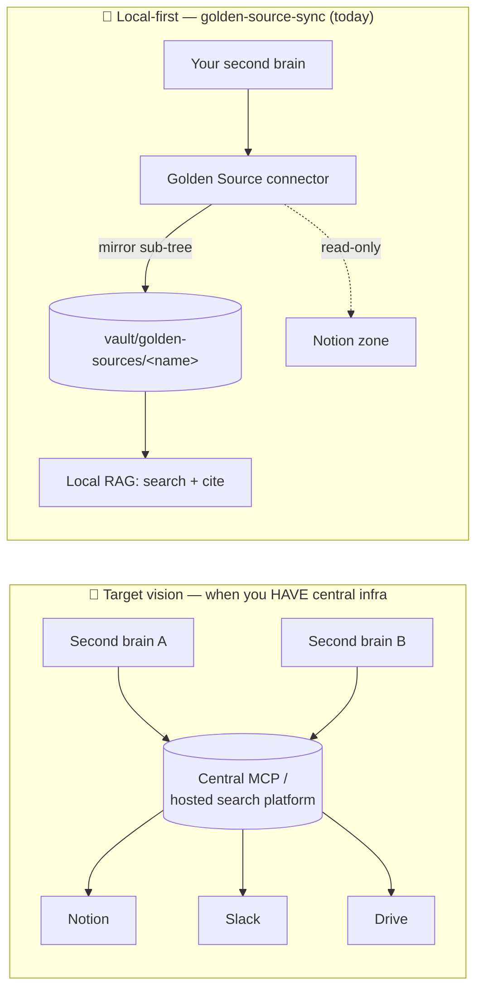

# Golden-source post-fixes — action plan to ship (QA → merge)

> Closes the **post-fixes QA round** (fresh brain `gss-qa-fresh`, 2026-06-18). Source of findings:
> `golden-source-qa-postfixes-feedback.md` (FR scratch journal). This plan turns the 3 new findings
> (Obs 3/4/5) into green, TDD baby-steps, then ships the `golden-source-sync` branch up to merge.
>
> **Branch:** `golden-source-sync` (committed, **NOT pushed**). Push/merge/tag **only on Thomas's
> explicit green light**. No CI on this repo → suites run locally.
>
> **Language guard:** EN = "Golden Source"; FR user-facing = « source de vérité » (never « source
> d'or »). Identifiers (`golden-source`, `golden_source`, `vault/golden-sources/`, MCP tools) stay
> English in every language.
>
> **Confidential:** QA zone = ex-employer private Notion data. Purge throwaway brains
> (`~/gss-qa-fresh`, `~/gss-qa-brain`) and `/tmp/gss-qa` at the end. Never copy real names/content.
>
> **▶️ Resume contract (survives `/clear`).** This file is the single source of truth for progress.
> To resume: open it, find the **first unchecked box**, continue from there. Tick each box `- [x]`
> **only after** the corresponding suite is green / change is committed, and append _(date · commit)_
> next to it. Doc-only tick commits are separate from the fix commit (commit-only-green). The memory
> `golden-source-sync-progress` points here.

---

## 🌙 TONIGHT-SHIP MODE (2026-06-18) — lean critical path

Thomas must ship tonight so Inqom colleagues can start using it. Reprioritized:
- **DO NOW (zero-code, high impact):** Step 1 (Obs 4 local-first) + Step 3 (Obs 5 disclaimer) — skill prose.
- **DO IF QUICK:** Step 2 (Obs 3/F5 toast) — RAG TDD; else defer to fast-follow.
- **FAST-FOLLOW (post-ship, does NOT block usage):** Step 4 (why/when doc + Mermaid diagram).
- **THEN SHIP:** Step 5 quick re-check → Step 6 push/PR/`/code-review`/merge/tag.

## Tracking

- [x] **Step 0 — Pre-flight** (terminology audit, branch state, locate touch-points) _(2026-06-18)_
  - [x] 0a — Confirm EN/FR terminology is consistent across skill + docs (no « source d'or », EN keeps "Golden Source") _(2026-06-18 · grep: only negated mentions)_
  - [x] 0b — Confirm full suites green at HEAD before any change (harness / rag / gss + tsc) _(2026-06-18 · harness 287, rag 172, gss 74, tsc clean)_
- [x] **Step 1 — Obs 4 (P0, release-blocker UX): local-first orchestration** (skill) _(2026-06-18 · 8aece94)_
  - [x] 1a — Replace "sync-first then search" routing with "answer local-first + background `check_freshness`" _(8aece94)_
  - [x] 1b — Bake the validated 🔄 wording (Obs 4-ter) as the default in-perimeter script _(8aece94)_
  - [x] 1c — Add "already synced this session → don't re-sync" guard wording _(8aece94)_
  - [x] 1d — Cap default RAG passes (1 targeted search; widen only if first pass is poor) _(8aece94)_
  - [ ] 1e — Client checkpoint (Thomas) on the new in-perimeter behavior → folded into Step 5 fresh validation
- [x] **Step 2 — Obs 3 (= F5): indexing-toast wording** (RAG `notify`) _(2026-06-18 · ee770f2)_
  - [x] 2a — Locate FileWatcher debounce + notifier; reproduce mid-index "done/partial" with a RED test _(ee770f2 · IndexingBurst RED→GREEN)_
  - [x] 2b — Distinguish in-progress (no "done", non-final/uncounted) from final (settled, correct count) _(ee770f2 · accumulate + settle, "complete" wording)_
  - [x] 2c — Green; full rag suite + tsc _(ee770f2 · rag 178/178, tsc clean)_
  - [ ] 2d — Client checkpoint (toast wording during a real sync) → folded into Step 5 fresh validation
- [x] **Step 3 — Obs 5: scope disclaimer** (skill wording) _(2026-06-18 · 8aece94)_
  - [x] 3a — Onboarding disclaimer: only the root page's sub-tree is mirrored; links to other Notion spaces are not _(8aece94)_
  - [x] 3b — Repeat the limit in the post-sync recap _(8aece94)_
  - [x] 3c — At use-time: flag when a followed link leaves the mirrored perimeter _(8aece94)_
  - [ ] 3d — Client checkpoint → folded into Step 5 fresh validation
- [x] **Step 4 — Doc & diagram: why/when a golden source** (user-facing) _(2026-06-18 · 97310a4)_
  - [x] 4a — User-facing "Why a golden source — and when it is / isn't worth it" section _(97310a4 · CONNECTORS.md)_
  - [x] 4b — Mermaid diagram: target vision (central MCP queried by brains) vs local Golden Source fallback _(97310a4)_
  - [x] 4c — Cross-link the maintainers PRD (§1 positioning, §19 trajectory) so the two stay in sync _(97310a4 · both-way links, anchors verified)_
  - [x] 4d — Commit (docs) _(97310a4)_
- [ ] **Step 5 — Fresh end-to-end validation** (new throwaway brain)
  - [x] 5a — Install a brand-new throwaway brain from the branch _(2026-06-18 · `~/gss-qa-ship`, in-process, post-flight canary OK; golden-source skill + MCP 6 tools smoke-tested green)_
  - [ ] 5b — Re-run the in-perimeter flow: local-first latency OK, toast correct, disclaimer shown, citations `www.notion.so` _(Thomas — manual QA, new conversation rooted in `~/gss-qa-ship`)_
  - [ ] 5c — Record result; fix any regression (back to the relevant step) before shipping
- [ ] **Step 6 — Ship (up to merge)**
  - [ ] 6a — Push branch `golden-source-sync`
  - [ ] 6b — Open PR (codename « The One With… », EN body) — describe the QA round + the 3 fixes + doc
  - [~] 6c — Run `/code-review` on the full branch diff (first time on this branch) — triage findings
        _(2026-06-18 · run early/autonomously while Step 5 pends; 7 finder angles. Net: 1 real fix, rest
        refuted or low-priority backlog — see below.)_
  - [x] 6d — Fix accepted findings (TDD, green) — defer the rest to a backlog note _(2026-06-18 · c903dbc:
        deletion-loop try/catch guard; deferred findings → backlog)_
  - [ ] 6e — Final manual QA pass green
  - [ ] 6f — Merge to `main` + tag (semver + codename)
  - [ ] 6g — Archive delivered plans (`git mv` → `plans/archived/`, STATUS ✅ + proof), update plans README
  - [ ] 6h — Purge confidential throwaway brains + `/tmp/gss-qa`

---

## Step details

### Step 0 — Pre-flight

- [ ] **0a — Terminology audit.** Grep skill + docs for « source d'or » (must be 0) and confirm EN prose
      uses "Golden Source". The skill already states the rule (SKILL.md "Terminology"); just verify no
      regression and that any new prose (Steps 1/3) follows it.
- [ ] **0b — Baseline green.** Run the three suites + `tsc` and record counts, so each later step is a
      clean delta. (No commit; just the safety net.)

### Step 1 — Obs 4 (P0): local-first orchestration (skill)

> **Finding.** The skill prescribes a **blocking** `sync` before answering an in-perimeter question
> (`SKILL.md` l.28-31 + the "Exploit the sync" block) → unacceptable latency, contradicts the brain's
> local-first heuristic. **Target validated by Thomas** (feedback Obs 4-ter): answer from local
> immediately + a **light `check_freshness` in the background** + complete afterwards if something
> changed. Secondary: the agent stacked **4 sequential RAG searches**; default to fewer.

- [ ] **1a — Flip the routing.** In `golden-source/SKILL.md`, replace the "sync that one source first,
      then search" guidance with: on an in-perimeter question → **(1)** answer **now** from the local RAG;
      **(2)** fire **`check_freshness <name>`** in the background (cheap, watermark-only — **not** a full
      `sync`); **(3)** only if it reports `behind`, run `sync` and **amend** the answer.
- [ ] **1b — Bake the validated wording.** Use the 🔄 script Thomas approved: *"Je te réponds tout de
      suite avec le local, et je vérifie en parallèle. 🔄 Je lance en tâche de fond un check de fraîcheur
      sur <source> — je complète si ça change quelque chose."* then close with *"🔄 Mise à jour fraîcheur:
      …"*. Keep the existing F9 safeguard (don't give a confident false negative) but **decoupled from any
      blocking sync** — listing perimeter titles is cheap and local.
- [ ] **1c — "Already synced this session" guard.** Wording so the agent does not re-`sync` a source it
      just connected/synced in the same session (the QA case: 0-change sync right after `setup_source`).
- [ ] **1d — Cap RAG passes.** Default to **one targeted** RAG search when the question is precise;
      widen (parallel/extra passes) only if the first pass is thin — not 4 systematically.
- [ ] **1e — Checkpoint + commit.** Mostly prose (no MCP change expected — the server already exposes
      `check_freshness` and `sync`). Thomas re-tests an in-perimeter question on the throwaway brain
      (fast first answer + background freshness line). Commit `docs(golden-source): local-first routing`.

> ⚠️ Implementation nuance (recorded, not blocking): on Desktop the "background" runs **within the same
> turn** (light check, then answer). With `check_freshness` (cheap) the answer stays near-instant. True
> post-response async completion would need a turn-relaunch mechanism — out of scope for this ship
> (linked to the "background freshness" / F10 backlog).

### Step 2 — Obs 3 (= F5): indexing-toast wording (RAG `notify`)

> **Finding.** The OS toast "**Second brain — Indexing done — 8 notes ready to search**" fires **during**
> indexing (per debounced batch), with a **partial count** and a misleading "**done**". 27 pages were
> written; the toast claimed 8 + "done". Aligns the toast with the truth the agent already states.

- [ ] **2a — Locate + RED.** Find the notifier (`rag/.../notify.ts`) and the FileWatcher debounce that
      triggers it. Write a failing test: a notification emitted while writes are still pending must **not**
      say "done", and the **final** notification carries the **settled** count.
- [ ] **2b — GREEN.** Either (preferred) emit a single **final** toast once the debounce window elapses
      with no new write (deterministic settle, ADR 0009 spirit) + optional non-final, **uncounted**
      "Indexing…" progress; or at minimum never say "done"/a count until settled.
- [ ] **2c — Suite green** (`rag/` + tsc).
- [ ] **2d — Checkpoint + commit.** Thomas watches a real sync's toasts. Commit `fix(rag): truthful
      indexing notification (F5/Obs 3)`.

### Step 3 — Obs 5: scope disclaimer (skill wording)

> **Finding.** Mirroring covers **only the sub-tree of the declared root page**; pages linked from other
> Notion spaces are **not** mirrored (by design — SKILL.md l.54). Users expect "the whole HUB" → silent
> gaps. Needs an explicit disclaimer + use-time signalling. (No MCP behavior change.)

- [ ] **3a — Onboarding disclaimer.** In `setup_source` flow: state clearly, before/at connection, that
      **only pages and sub-pages under the declared root** are mirrored, and **links to other Notion
      spaces/trees are not** integrated.
- [ ] **3b — Post-sync recap.** Repeat the boundary in the recap (e.g. "27 pages under <root>; pages
      linked outside this sub-tree are not included").
- [ ] **3c — Use-time signalling.** When the brain follows/cites a link that leaves the mirrored
      perimeter, flag it ("this page is outside the mirrored perimeter — not held locally") to avoid a
      silent false negative.
- [ ] **3d — Checkpoint + commit** `docs(golden-source): perimeter disclaimer (Obs 5)`.

### Step 4 — Doc & diagram: why/when a golden source (user-facing) ✅ _(2026-06-18 · 97310a4)_

> **Goal.** Make the "why" reachable by users (today it lives only in the maintainers PRD §1/§19). Add a
> diagram contrasting the **target vision** (a central, hosted MCP search platform that brains query)
> with the **local Golden Source connector** that mirrors a source into the vault — the fallback
> "super-power" when no central MCP infrastructure exists.

- [ ] **4a — "Why / when" section** (user-facing doc — the CONNECTORS/SETUP doc that already mentions
      golden sources, see commit `3fc2b55`). Cover: *when it helps* (no central search infra; you want a
      live internal zone searchable + citable, offline-capable, local-first) and *when it is NOT worth
      it* (a real central MCP/search platform already exists → query that instead; one-off content →
      a plain note; sources outside Notion today → not yet supported).
- [ ] **4b — Mermaid diagram** (draft below) embedded in that doc. Two panels: target central-MCP vs
      local Golden Source mirror.
- [ ] **4c — Cross-link the PRD** (§1 positioning, §19 trajectory) ↔ the user doc so they don't drift.
- [ ] **4d — Commit** `docs: why & when to use a golden source (+ target-vs-local diagram)`.

**Draft diagram (to refine in 4b):**

> Caption to write: *"With central infrastructure, brains query one hosted platform. Without it, the
> Golden Source connector mirrors a live zone into your own vault — searchable, citable, yours, right
> now. Same vault contract; the day a central platform exists, you switch over without rewriting the
> engine (PRD §19)."*

### Step 5 — Fresh end-to-end validation

- [ ] **5a — New throwaway brain** installed from the branch (outside the launcher; confidential rules).
- [ ] **5b — Re-run** the in-perimeter flow and assert: fast first answer (no blocking sync), correct
      indexing toast, perimeter disclaimer shown, citations `www.notion.so`, no « source d'or ».
- [ ] **5c — Record** the result; any regression → back to the relevant step before shipping.

### Step 6 — Ship (up to merge)

- [ ] **6a — Push** `golden-source-sync`.
- [ ] **6b — PR** (codename « The One With… », **English** title + body): the post-fixes QA round, the 3
      fixes (Obs 4/3/5), the verified-green carry-overs (F1/F3/F6/F8/F11), and the doc/diagram.
- [ ] **6c — `/code-review`** on the full branch diff (first run on this branch). Triage findings.
- [ ] **6d — Fix** accepted findings (TDD, green); **defer** the rest to a backlog note (don't scope-creep
      the release).
- [ ] **6e — Final manual QA** pass green.
- [ ] **6f — Merge** to `main` + **tag** (semver bump from the last golden tag + codename).
- [ ] **6g — Archive** delivered plans (`golden-source-qa-postfixes-action.md`, and any sibling now done)
      → `plans/archived/` with STATUS ✅ + proof; update the plans README.
- [ ] **6h — Purge** `~/gss-qa-fresh`, `~/gss-qa-brain`, `/tmp/gss-qa`.

---

## Out of scope for this ship (backlog)

- [ ] Multi-root sources / following outbound links N levels deep (Obs 5 future option).
- [ ] True async "answer now, correction arrives later" (turn-relaunch) — F10 background freshness.
- [ ] Retrieval dedup across overlapping sources (O1 from Block B).
- [ ] Bloc B deferred items F2/F10 and any non-blocker polish.

### Code-review findings deferred (2026-06-18, not blocking the ship)

- [ ] **Concurrent `sync()` of the SAME source has no lock** — two interleaved syncs race on the
      state read-modify-write (last-write-wins). Low for the single-process MCP / serial UX of the
      MVP; revisit if multi-window concurrency lands. (`golden-source-sync.ts:sync`)
- [ ] **`checkFreshness()` throws on an enumeration error** (401/429/network) instead of returning a
      degraded report. Loud failure is acceptable (the tool relays it), but a `{ behind: false,
      error }` shape would be friendlier for the local-first background check. (`golden-source-sync.ts:checkFreshness`)
- [ ] **Source `name` has no path-safety validation** (bare `z.string()`). `path.join` currently
      normalizes safely, so it's latent, not exploitable today; add an allowlist (`^[a-z0-9-]+$`) when
      convenient. (`golden-source-sync/src/index.ts` setup schema)
- [ ] **`contentHash` / `resolvePath` duplicated** between `rag/` and `golden-source-sync/` — by
      design (package isolation, no cross-import), noted so a future shared-utils pass can reconsider.
- [x] **REFUTED (no action):** `extractPageId` 32-hex anchor (correct — takes the final 32 hex);
      markdown-link parens regex (non-Notion targets returned verbatim → no corruption; Notion canonical
      URLs carry no parens). F6 citations stand. _(2026-06-18)_
